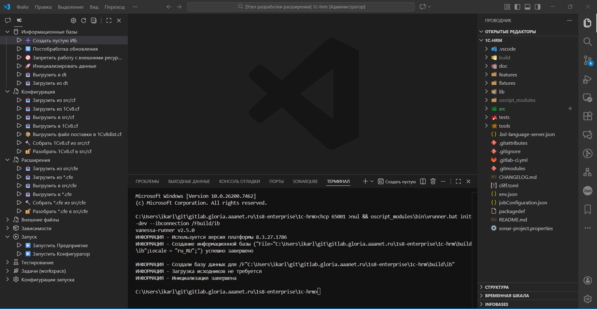

# 1C Platform Tools

[](https://openyellow.org/grid?filter=top&repo=1113279075)

Расширение для Visual Studio Code с инструментами разработки для экосистемы 1С. Предоставляет удобный интерфейс для работы с проектами 1С через панель команд и дерево задач.

## Возможности

Откройте панель "1C Platform Tools" в боковой панели VS Code. Все команды организованы по категориям:

### Панель команд 1C Platform Tools



Все команды доступны через дерево задач в боковой панели:

- **Информационные базы**: операции с ИБ
- **Конфигурация**: работа с конфигурацией
- **Расширения**: работа с расширениями
- **Внешние файлы**: обработки и отчеты
- **Зависимости**: управление зависимостями
- **Запуск**: запуск приложений 1С
- **Тестирование**: тесты и проверки
- **Задачи (workspace)**: задачи и конфигурации запуска

Также доступны команды через палитру команд (`Ctrl+Shift+P` → введите "1C").

## Требования

- Visual Studio Code версии 1.106.1 или выше
- Node.js версии 18.x или выше
- OneScript (oscript) - для выполнения скриптов
- vanessa-runner (vrunner) - для выполнения команд 1С
- OPM (OneScript Package Manager) - для управления зависимостями

## Установка

1. Откройте VS Code
2. Перейдите в раздел Extensions (Ctrl+Shift+X)
3. Найдите "1C Platform Tools"
4. Нажмите "Install"

## Настройка

Расширение автоматически активируется при открытии проекта 1С (наличие файла `packagedef` в корне проекта).

Настройки доступны через `File > Preferences > Settings` (или `Ctrl+,`) и поиск "1C Platform Tools". Параметры подключения к информационной базе настраиваются в файле `env.json` в корне проекта:

```json
{
  "default": {
    "--ibconnection": "/F./build/ib"
  }
}
```

## Структура проекта

Расширение опирается на структуру каталогов проекта [vanessa-bootstrap](https://github.com/yellow-hammer/vanessa-bootstrap) — шаблона правильной разработки на платформе 1С:Предприятие 8.

Рекомендуемая структура проекта:

```txt
project/
├── build/
│   ├── ib/                 # Информационная база
│   └── out/                # Собранные файлы
├── src/
│   ├── cf/                 # Исходники конфигурации
│   ├── cfe/                # Исходники расширений
│   ├── epf/                # Исходники внешних обработок
│   └── erf/                # Исходники внешних отчетов
├── oscript_modules/        # Зависимости (устанавливаются через OPM)
├── env.json                # Настройки подключения к ИБ
└── packagedef              # Файл для активации расширения
```

### Работа с Docker

Расширение поддерживает выполнение команд vrunner через Docker-контейнеры. Это полезно для работы в окружениях без локальной установки платформы 1С (например, GitHub Codespaces).

**Подготовка Docker-образа:**

Docker-образы для работы с платформой 1С и vanessa-runner можно собрать из репозитория [pravets/onec-images](https://github.com/pravets/onec-images):

1. Форкните репозиторий [pravets/onec-images](https://github.com/pravets/onec-images)
2. Следуйте инструкциям в репозитории для сборки образа `vrunner`
3. Опубликуйте собранный образ в ваш Docker registry (Docker Hub, GitHub Container Registry и т.д.)

**Настройка Docker в расширении:**

1. Включите Docker-режим: `1c-platform-tools.docker.enabled = true`
2. Укажите Docker-образ: `1c-platform-tools.docker.image = "your-registry/vrunner:8.3.27.1786"`

**Важно:**

- Docker-образ должен содержать установленную платформу 1С:Предприятие и vanessa-runner
- При использовании Docker параметр `--ibcmd` используется автоматически (так как в Docker нет GUI)
- Пути автоматически нормализуются для Docker-окружения (`/F./build/ib` → `/F./workspace/build/ib`)
- **Ограничение**: В Docker можно выполнять только команды, которые поддерживают `--ibcmd`:
  - ✅ Операции с информационными базами (init-dev, update-dev, dump, restore, dump-dt, load-dt)
  - ✅ Операции с конфигурацией (load, dump, dumpcf, compile, decompile)
  - ✅ Операции с расширениями (compileext, decompileext, unloadext, compileexttocfe)
  - ✅ Операции с внешними файлами (compileepf, decompileepf)
  - ❌ Запуск приложений (run, designer) - требуют GUI
  - ❌ Тестирование (xunit, syntax-check, vanessa) - могут требовать GUI
  
  При попытке выполнить команду, которая не поддерживает `--ibcmd`, расширение покажет предупреждение.

## Важные нюансы

- Все команды выполняются в терминале VS Code для видимости вывода
- Расширение автоматически ищет `vrunner.bat` в `oscript_modules/bin/` проекта
- Параметр `--ibconnection` берется из `env.json` (секция `default['--ibconnection']`, по умолчанию `/F./build/ib`)
- Все пути к файлам внутри workspace должны быть относительными
- Для использования `ibcmd` требуется установка платформы 1С:Предприятие с компонентом **"Сервер 1С: Предприятия 8"** (настройка `1c-platform-tools.useIbcmd`)
- При использовании Docker (`docker.enabled = true`) параметр `--ibcmd` используется автоматически

## Для разработчиков

Если вы хотите внести вклад в проект или разработать собственные команды, ознакомьтесь с [документацией для разработчиков](docs/README.md).

## Лицензия

MIT License. Подробности см. в файле [LICENSE](LICENSE).

## Автор

Ivan Karlo (<i.karlo@outlook.com>)

При желании, отблагодарить автора можно по ссылке:

- [Boosty](https://boosty.to/1carlo/donate)
- [Сбор в Т-банк](https://www.tbank.ru/cf/4kILVyrLKwq)
