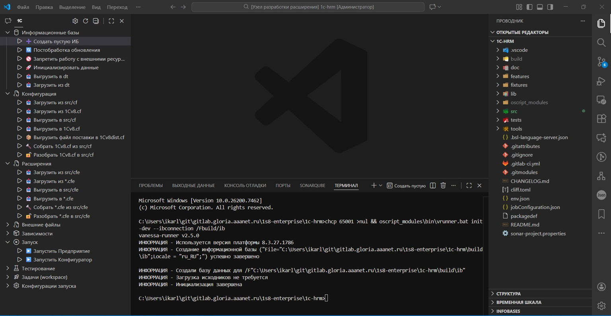

# 1C: Platform Tools

[](https://openyellow.org/grid?filter=top&repo=1113279075)
[](https://t.me/wonder_yellow)
[](https://deepwiki.com/yellow-hammer/vscode-1c-platform-tools)

Расширение для Visual Studio Code, которое собирает повседневные инструменты разработки 1С в одном интерфейсе: команды vanessa-runner, навигацию по проектам и артефактам, дерево метаданных, TODO-панель, отладку и интеграцию с AI-агентами.

## Содержание

- [Возможности](#возможности)
- [Быстрый старт](#быстрый-старт)
- [Панели расширения](#панели-расширения)
- [Настройки](#настройки)
- [Интеграция с AI и MCP](#интеграция-с-ai-и-mcp)
- [Для разработчиков](#для-разработчиков)

## Возможности

- **Инструменты 1С**: дерево команд для информационных баз, конфигурации, расширений, внешних обработок и отчётов, поставки, запуска, тестирования и зависимостей.
- **Проекты 1С**: поиск проектов по папкам с `packagedef`, избранное, теги, быстрый переход через статусную строку и QuickPick.
- **Артефакты 1С**: отдельное дерево конфигураций, расширений, обработок, отчётов и feature-файлов с действиями сборки, разбора и запуска тестов.
- **Метаданные 1С**: дерево выгрузки конфигурации через [md-sparrow](https://github.com/yellow-hammer/md-sparrow), создание и редактирование объектов, фильтр по подсистемам.
- **ER-диаграммы**: интерактивные схемы связей метаданных с фильтрами, поиском объектов и экспортом в Mermaid, Draw.io, SVG и PNG.
- **Список дел**: поиск TODO/FIXME/XXX/HACK/BUG по BSL, OScript, Markdown и Gherkin-файлам.
- **Отладка 1С**: DAP-интеграция через [onec-debug-adapter](https://github.com/yellow-hammer/onec-debug-adapter).
- **AI и MCP**: установка навыков для агентов, запуск команд через файл-триггер и MCP-сервер [mcp-1c-platform-tools](https://github.com/yellow-hammer/mcp-1c-platform-tools).



## Требования

- Visual Studio Code `1.103.0` или новее.
- Для команд 1С нужна платформа 1С:Предприятие, OneScript, OPM и vanessa-runner. Часть зависимостей можно установить из раздела **Зависимости**.
- Для отладки 1С нужен [.NET 8](https://dotnet.microsoft.com/download/dotnet/8.0).
- Для дерева метаданных расширение может автоматически скачать md-sparrow и portable JRE, если не указаны локальные пути.

## Установка

1. Откройте VS Code.
2. Перейдите в Extensions (`Ctrl+Shift+X`).
3. Найдите **1C: Platform Tools** (`yellow-hammer.1c-platform-tools`).
4. Нажмите **Install**.

Расширение активируется для проекта 1С при наличии файла `packagedef` в корне рабочей папки. Панель **Проекты 1С** доступна отдельно и помогает открыть нужный проект даже до активации остальных панелей.

## Быстрый старт

1. Откройте существующий проект 1С с файлом `packagedef` или выполните команду **1C: Зависимости: Инициализировать проект**.
2. При необходимости выполните **1C: Зависимости: Инициализировать структуру проекта**. Будут созданы каталоги по шаблону [vanessa-bootstrap](https://github.com/yellow-hammer/vanessa-bootstrap).
3. Настройте подключение к информационной базе в `env.json`:

   ```json
   {
     "default": {
       "--ibconnection": "/F./build/ib"
     }
   }
   ```

4. Установите зависимости через раздел **Зависимости** или команду **1C: Зависимости: Установить зависимости**.
5. Откройте активность **Инструменты 1С** и запускайте нужные команды из дерева.

Рекомендуемая структура проекта:

```txt
project/
├── build/
│   ├── ib/                 # Информационная база
│   └── out/                # Результаты сборки
├── src/
│   ├── cf/                 # Исходники конфигурации
│   ├── cfe/                # Исходники расширений
│   ├── epf/                # Исходники внешних обработок
│   └── erf/                # Исходники внешних отчётов
├── tasks/                  # Задачи OScript
├── tools/                  # Настройки и вспомогательные утилиты
├── env.json                # Подключение к ИБ и параметры запуска
└── packagedef              # Файл проекта и зависимостей OPM
```

## Панели расширения

### Инструменты 1С

Основное дерево команд доступно в activity bar как **Инструменты 1С**. Разделы дерева берутся из единого списка команд расширения:

- **Информационные базы**: создание, обновление, загрузка/выгрузка DT, инициализация данных.
- **Конфигурация**: загрузка и выгрузка `src/cf`, работа с `1Cv8.cf`, инкрементальная загрузка/выгрузка, сборка и разбор.
- **Расширения**: загрузка и выгрузка `src/cfe`, работа с `*.cfe`, сборка и разбор.
- **Внешние файлы**: сборка и разбор `epf`/`erf`, очистка кэша.
- **Поддержка** и **Поставка**: команды поддержки конфигурации и подготовки файлов поставки.
- **Зависимости**: инициализация `packagedef`, структуры проекта, Git, OneScript, OPM и зависимостей.
- **Запуск**, **Тестирование**, **Установить версию**, **Конфигурации запуска**, **Навыки для AI**, **Помощь и поддержка**.

Любую команду дерева можно добавить в избранное через **1C: Дерево: Настроить избранное**. Команды также доступны из палитры команд (`Ctrl+Shift+P`, затем `1C`).

### Проекты 1С

Панель **Проекты 1С** помогает быстро переключаться между рабочими папками:

- **Избранное** хранит проекты с тегами и может показывать их списком или по тегам.
- **Все проекты** сканирует указанные папки и ищет каталоги с `packagedef`.
- Статусная строка показывает текущий проект и открывает QuickPick выбора.
- Команда **Открыть список проектов 1С** доступна из палитры и по горячей клавише `Ctrl+Alt+P` / `Cmd+Alt+P`.

### Артефакты 1С

В Explorer доступна панель **Артефакты 1С**. Она показывает поддерживаемые файлы проекта: `*.cf`, `*.cfe`, `*.epf`, `*.erf`, `*.feature` и соответствующие каталоги исходников. Для элементов доступны открытие, сборка, разбор, удаление и запуск Vanessa-тестов для feature-файлов.

### Метаданные 1С

Активность **Метаданные 1С** показывает структуру основной конфигурации, расширений и внешних артефактов через md-sparrow.

В панели доступны:

- построение дерева метаданных;
- создание пустой конфигурации;
- добавление, переименование, удаление и дублирование объектов;
- редактирование свойств объектов;
- фильтр по подсистемам.

Подробнее: [docs/md-sparrow.md](docs/md-sparrow.md).

### ER-диаграммы метаданных

Для объекта метаданных можно открыть интерактивную ER-диаграмму:

- построение графа по выбранному объекту или по проекту;
- настройка охвата связей;
- фильтры видов связей;
- поиск и добавление объектов;
- экспорт в Mermaid, Draw.io, SVG и PNG.

По умолчанию экспорт сохраняется в `docs/schemas`.

### Список дел

Панель **Список дел** находится в нижней панели VS Code и собирает комментарии с тегами `TODO`, `FIXME`, `XXX`, `HACK`, `BUG`.

Можно переключать отображение списком или по файлам, фильтровать по тегам и ограничивать область поиска текущим файлом, всем проектом или типом файла.

### Отладка 1С

Расширение регистрирует отладчик `1Cpt: Enterprise Debugger` и использует внешний [onec-debug-adapter](https://github.com/yellow-hammer/onec-debug-adapter).

Минимальная настройка:

1. Установите [.NET 8](https://dotnet.microsoft.com/download/dotnet/8.0).
2. Укажите строку подключения к ИБ в `env.json`.
3. Создайте конфигурацию запуска типа `1Cpt:Enterprise` в `launch.json`.
4. Запустите отладку из панели **Run and Debug**.

При создании конфигурации расширение использует настройки `1c-platform-tools.paths.cf` и `1c-platform-tools.paths.cfe` для заполнения `rootProject` и `extensions`.

## Настройки

Открыть настройки можно через команду **1C: Дерево: Настройки**. Она показывает разделы: **Сервер IPC**, **Проекты**, **Инструменты**, **Артефакты**, **Список дел**, **Метаданные 1С**, **Общее**.

Основные группы настроек:

- `1c-platform-tools.vrunner.*`, `1c-platform-tools.paths.*`, `1c-platform-tools.useIbcmd`, `1c-platform-tools.docker.*`, `1c-platform-tools.logLevel` — инструменты и выполнение команд.
- `1c-platform-tools.projects.*` — папки поиска проектов, теги, кэш, сортировка, поведение открытия.
- `1c-platform-tools.todo.*` — glob-паттерны, исключения и теги TODO.
- `1c-platform-tools.artifacts.exclude` — исключения при сканировании артефактов.
- `1c-platform-tools.metadata.*` — md-sparrow, Java/JRE и настройки экспорта ER-диаграмм.
- `1c-platform-tools.ipc.*` — IPC-сервер для MCP.

### Проекты 1С

Для автообнаружения проектов укажите папки поиска:

```json
{
  "1c-platform-tools.projects.baseFolders": [
    "~/projects",
    "D:/work/1c"
  ]
}
```

Если `baseFolders` пустой, вкладка **Все проекты** не найдёт проекты автоматически. Избранные проекты можно добавлять вручную из открытой рабочей папки.

### Логирование

Логи пишутся в **Output** → **1C: Platform Tools**. Уровень задаётся настройкой `1c-platform-tools.logLevel`:

- `error` — только ошибки;
- `warnings` — ошибки и предупреждения;
- `info` — обычный режим;
- `debug` — подробный вывод для диагностики.

При ошибке команды включите `debug`, повторите действие и приложите вывод к issue.

### Docker и ibcmd

Расширение умеет выполнять команды vrunner через Docker. Включите режим и укажите образ:

```json
{
  "1c-platform-tools.docker.enabled": true,
  "1c-platform-tools.docker.image": "your-registry/vrunner:8.3.27"
}
```

Docker-образ должен содержать платформу 1С:Предприятие и vanessa-runner. В Docker автоматически используется `ibcmd`, поэтому доступны только команды, которые могут работать без GUI.

## Интеграция с AI и MCP

Расширение поддерживает несколько способов работы с AI-агентами.

### Навыки для агента

В разделе **Навыки для AI** доступны команды:

- **Добавить навыки разработки 1С (cc-1c-skills)**;
- **Добавить навыки расширения (команды и MCP)**.

Навык можно установить в `.cursor/skills/`, `.github/copilot/skills/`, `.claude/skills/` или другую папку, которую использует агент.

### Файл-триггер

Агент может создать файл `.cursor/1c-platform-tools-run-command` с одной строкой — идентификатором команды, например:

```txt
1c-platform-tools.run.designer
```

Расширение выполнит команду и удалит файл.

### MCP

Для прямого вызова команд используйте MCP-сервер [mcp-1c-platform-tools](https://github.com/yellow-hammer/mcp-1c-platform-tools).

Быстрый старт:

1. Включите настройку `1c-platform-tools.ipc.enabled`.
2. Установите MCP-сервер `mcp-1c-platform-tools`.
3. Откройте проект 1С с активным расширением.

Если меняете порт или токен IPC, задайте те же значения в конфигурации MCP через `ONEC_IPC_PORT` и `ONEC_IPC_TOKEN`.

## Важные нюансы

- Все команды vrunner выполняются в терминале VS Code, чтобы был виден вывод.
- По умолчанию расширение ищет `vrunner` и может использовать `oscript_modules/bin/vrunner.bat` проекта.
- Строка подключения к ИБ берётся из `env.json`, секция `default["--ibconnection"]`.
- Пути в настройках проекта задаются относительно workspace, если не указано иное.
- Для `ibcmd` нужна платформа 1С:Предприятие с компонентом сервера 1С.
- Панели **Инструменты 1С**, **Метаданные 1С**, **Артефакты 1С** и **Список дел** показываются для проектов 1С.

## Для разработчиков

- Документация: [docs/README.md](docs/README.md)
- Участие в разработке: [CONTRIBUTING.md](CONTRIBUTING.md)
- Безопасность: [SECURITY.md](SECURITY.md)
- Лицензия: [MIT](LICENSE)

## Автор и поддержка

Автор: Ivan Karlo (<i.karlo@outlook.com>)

Поддержать проект:

- [Boosty](https://boosty.to/1carlo/donate)
- [Чаевые](https://pay.cloudtips.ru/p/d752cb43)
