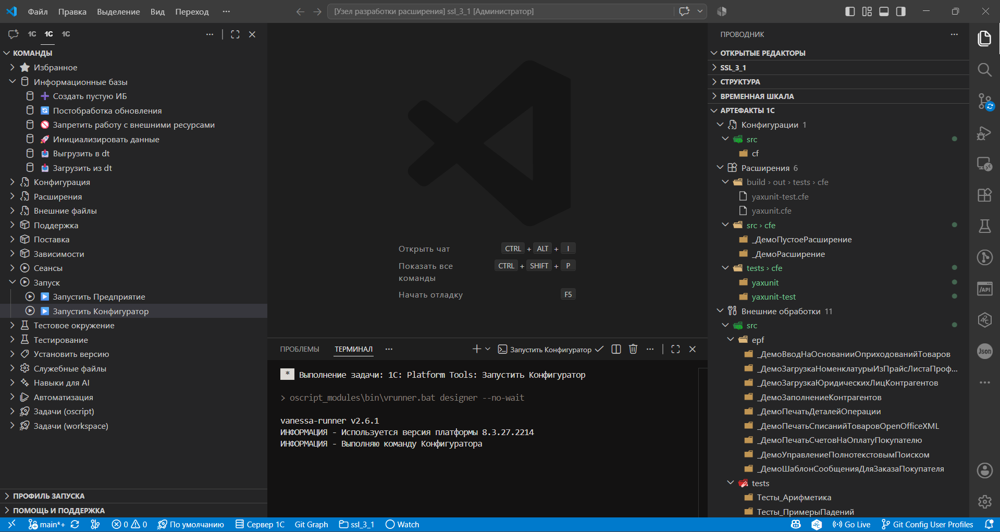

# 1C: Platform Tools

[](https://openyellow.org/grid?filter=top&repo=1113279075)
[](https://t.me/wonder_yellow)
[](https://deepwiki.com/yellow-hammer/vscode-1c-platform-tools)

Расширение для Visual Studio Code, которое собирает повседневные инструменты разработки 1С в одном интерфейсе: команды vanessa-runner, навигацию по проектам и артефактам, дерево метаданных, TODO-панель, отладку и интеграцию с AI-агентами.



## Возможности

- **[Инструменты 1С](docs/tools.md)** — дерево команд: информационная база, конфигурация, расширения, внешние файлы, поставка, запуск, тестовое окружение и тестирование, зависимости.
- **[Автоматизация](docs/automation.md)** — пайплайны: визуальный редактор цепочек с ветками на успех и ошибку; хуки команд до, после и при ошибке.
- **[Проекты 1С](docs/projects.md)** — поиск проектов, избранное, теги, переключение через статус-бар и палитру команд.
- **[Администрирование 1С](docs/admin.md)** — список информационных баз платформы и запуск Предприятия или Конфигуратора; консоль кластера через `rac`: подключения к `ras`, сеансы, соединения, блокировки.
- **[Артефакты 1С](docs/artifacts.md)** — дерево `*.cf`/`*.cfe`/`*.epf`/`*.erf` с действиями сборки и разбора.
- **[Метаданные 1С](docs/metadata.md)** — дерево метаданных, создание и редактирование объектов, поиск по имени, фильтр по подсистемам.
- **[ER-диаграммы](docs/er-diagrams.md)** — интерактивные схемы связей метаданных, экспорт в Mermaid, Draw.io, SVG, PNG.
- **[Тестирование](docs/testing.md)** — панель тестирования VS Code: дерево тестов Vanessa, xUnit, YAxUnit, OneScript и 1bdd, запуск из редактора, статусы и переход к падению, сборка тестовых обработок и тестовых расширений.
- **[Список дел](docs/todo.md)** — панель меток TODO/FIXME/XXX/HACK/BUG в коде проекта.
- **[Отладка 1С](docs/debug.md)** — точки останова с условиями, изменение значений переменных, отладка расширений и внешних обработок, замер производительности.
- **[Автономный сервер](docs/autonomous-server.md)** — публикация файловой ИБ через `ibsrv`: локальная разработка и отладка HTTP/Web/OData-сервисов, выбор публикуемых сервисов, открытие в браузере.
- **[AI и MCP](docs/ai-mcp.md)** — навыки для агентов, запуск команд через файл-триггер и MCP-сервер [mcp-1c-platform-tools](https://github.com/yellow-hammer/mcp-1c-platform-tools).
- **[Docker и ibcmd](docs/docker.md)** — выполнение команд в контейнере без локальной платформы 1С, включая GitHub Codespaces.

## Установка

Установите **1C: Platform Tools** (`yellow-hammer.1c-platform-tools`) из Marketplace (`Ctrl+Shift+X`).

Расширение активируется для проекта 1С при наличии файла `packagedef` в корне рабочей папки. Панели **Проекты 1С** и **Администрирование 1С** работают и без открытого проекта: первая поможет найти и открыть нужный, вторая не привязана к рабочей области вовсе.

## Что нужно для работы

- **Платформа 1С:Предприятие 8** — клиент, конфигуратор, `1cestart`, `rac`/`ras`, `ibsrv`, `ibcmd`.
- **OneScript, OPM и vanessa-runner** — из раздела **Зависимости** в дереве **Инструменты 1С**.
- **MCP** — расширение [mcp-1c-platform-tools](https://github.com/yellow-hammer/mcp-1c-platform-tools), если команды вызывает агент.

Без локальной 1С команды можно выполнять в Docker — см. [Docker и ibcmd](docs/docker.md).

## Быстрый старт

1. Откройте существующий проект 1С с файлом `packagedef` или выполните команду **1C: Зависимости: Инициализировать проект**.
2. При необходимости выполните **1C: Зависимости: Инициализировать структуру проекта**. Будут созданы каталоги по шаблону [vanessa-bootstrap](https://github.com/yellow-hammer/vanessa-bootstrap).
3. Настройте подключение к ИБ в основном [профиле запуска](docs/launch-profiles.md). Формат файла зависит от установленного vanessa-runner (расширение определяет версию автоматически):

   ```jsonc
   // env.json — vanessa-runner 2
   { "default": { "--ibconnection": "/F./build/ib" } }

   // autumn-properties.json — vanessa-runner 3
   { "vrunner": { "ibconnection": "/F./build/ib" } }
   ```

   Профиль можно создать из дерева **Служебные файлы** (пункт «Осн. профиль запуска») или из статус-бара.

4. Установите зависимости через раздел **Зависимости** или команду **1C: Зависимости: Установить зависимости**.
5. Откройте панель **Инструменты 1С** и запускайте нужные команды из дерева.

Рекомендуемая структура проекта:

```txt
project/
├── .1cpt/                  # Пайплайны и хуки команд
├── build/
│   ├── ib/                 # Информационная база
│   └── out/                # Результаты сборки
├── features/               # Сценарии Gherkin (Vanessa Automation)
├── src/
│   ├── cf/                 # Исходники конфигурации
│   ├── cfe/                # Исходники расширений
│   ├── epf/                # Исходники внешних обработок
│   └── erf/                # Исходники внешних отчётов
├── tasks/                  # Задачи OScript
├── tests/                  # Скриптовые тесты OneScript (*.os)
│   ├── cfe/                # Исходники тестовых расширений (YAxUnit и тесты)
│   └── epf/                # Исходники тестовых обработок (xUnit)
├── tools/                  # Настройки и вспомогательные утилиты
├── env.json                # Осн. профиль запуска (или autumn-properties.json для vrunner 3)
└── packagedef              # Файл проекта и зависимостей OPM
```

## Документация

- Руководства по функциям — в каталоге [docs](docs/README.md).
- Пошаговое знакомство со всеми панелями — walkthrough **Начало работы с 1C: Platform Tools** (Help → Welcome).

## Важные нюансы

- Все команды vrunner выполняются в терминале VS Code, чтобы был виден вывод.
- По умолчанию расширение ищет `vrunner` и может использовать `oscript_modules/bin/vrunner.bat` проекта.
- Пути в настройках проекта задаются относительно workspace, если не указано иное.

## Подпись кода

Подпись кода для релизов предоставляется бесплатно программой [SignPath Foundation](https://signpath.org/), сертификат выпущен от её имени.

## Автор и поддержка


Автор: Ivan Karlo (<i.karlo@outlook.com>)

Поддержать проект:

- [Boosty](https://boosty.to/1carlo/donate)
- [Чаевые](https://pay.cloudtips.ru/p/d752cb43)
