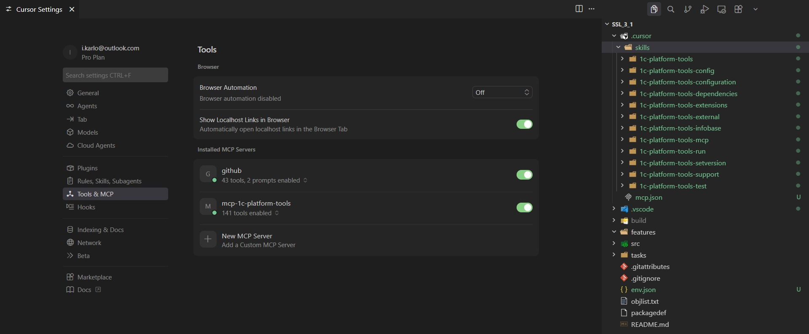

# AI и MCP

Расширение помогает AI-агентам (Cursor, Claude, Copilot) работать с проектом 1С: агент узнаёт, какие команды вызывать, и выполняет их через файл-триггер или MCP.



## Навыки для агента

В дереве **Инструменты 1С** → раздел **Навыки для AI**:

- **Добавить навыки разработки 1С (cc-1c-skills)** — XML, формы, роли, СКД, метаданные; скачиваются с GitHub при каждом вызове.
- **Добавить навыки расширения (команды и MCP)** — инструкции по командам расширения и MCP по доменам.

При установке выбирается папка назначения: `.cursor/skills/`, `.github/copilot/skills/`, `.claude/skills/` или другая, которую использует агент.

## Файл-триггер

Агент может создать файл `.cursor/1c-platform-tools-run-command` с одной строкой — идентификатором команды:

```txt
1c-platform-tools.run.designer
```

Расширение выполнит команду и удалит файл.

## MCP

Для прямого вызова команд агентом используется MCP-сервер [mcp-1c-platform-tools](https://github.com/yellow-hammer/mcp-1c-platform-tools):

1. Включите настройку `1c-platform-tools.ipc.enabled`.
2. Установите MCP-сервер `mcp-1c-platform-tools` в конфигурации агента.
3. Откройте проект 1С с активным расширением.

Порт и токен IPC задаются настройками `1c-platform-tools.ipc.port` и `1c-platform-tools.ipc.token`; те же значения передайте MCP-серверу через переменные окружения `ONEC_IPC_PORT` и `ONEC_IPC_TOKEN`.
