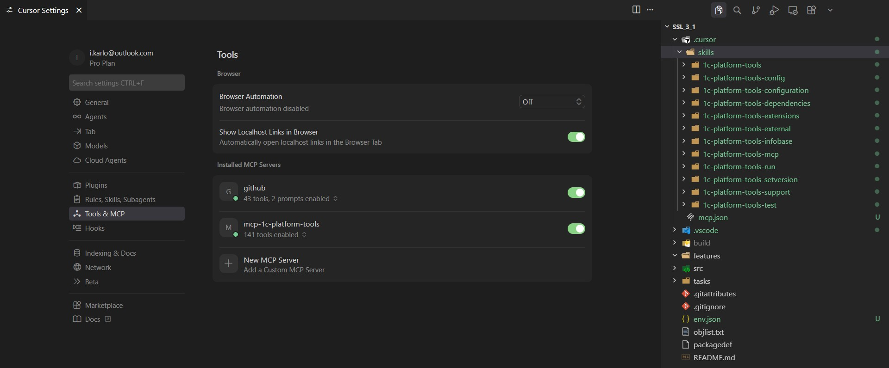

# AI и MCP

Расширение помогает AI-агентам (Cursor, Claude, Copilot) работать с проектом 1С: агент узнаёт, какие команды вызывать, и выполняет их через файл-триггер или MCP.



## Навыки для агента

В дереве **Инструменты 1С** → раздел **Навыки для AI**:

- **Добавить навыки разработки 1С (cc-1c-skills)** — XML, формы, роли, СКД, метаданные; скачиваются с GitHub при каждом вызове.
- **Добавить навыки расширения (команды и MCP)** — инструкции по командам расширения и MCP по доменам.

При установке выбирается папка назначения: `.cursor/skills/`, `.github/skills/`, `.claude/skills/` или другая, которую использует агент.

## Файл-триггер

Агент может создать файл `.cursor/1c-platform-tools-run-command` с одной строкой — идентификатором команды:

```txt
1c-platform-tools.run.designer
```

Расширение выполнит команду и удалит файл.

## MCP

Для прямого вызова команд агентом используется MCP-сервер [mcp-1c-platform-tools](https://github.com/yellow-hammer/mcp-1c-platform-tools):

1. Включите настройку `1c-platform-tools.ipc.enabled`.
2. Установите MCP-сервер `mcp-1c-platform-tools` в конфигурации агента.
3. Откройте проект 1С с активным расширением.

Порт и токен IPC задаются настройками `1c-platform-tools.ipc.port` и `1c-platform-tools.ipc.token`; те же значения передайте MCP-серверу через переменные окружения `ONEC_IPC_PORT` и `ONEC_IPC_TOKEN`.

### Как агент работает с командами

- **Результат вместо «команда запущена».** Инструменты MCP по умолчанию ждут завершения и возвращают `{ success, exitCode, stdout, stderr }`; прогоны тестов дополняют результат счётчиками из отчёта, поэтому упавшие тесты не выглядят успехом. Терминальный режим (`wait: false`) остаётся для случая, когда пользователь смотрит ход выполнения сам.
- **Окна не открываются.** Команда, вызванная агентом, никогда не показывает окна выбора: если данных не хватает, возвращается ошибка с подсказкой, какие параметры передать. Интерактивные мастера (поставка, установка версии, создание профиля) агенту недоступны — они выполняются пользователем.
- **Окружение запуска.** `env_status` показывает активный профиль, файл настроек и строку подключения; `env_selectProfile` переключает профиль по имени. Разовый прогон под другим файлом настроек задаётся параметром `settingsFile` — активный профиль при этом не меняется, а параметры вызова имеют приоритет над временными параметрами профиля.

Полный список параметров и примеры фраз для агента — в документации MCP-сервера: [общие параметры](https://github.com/yellow-hammer/mcp-1c-platform-tools/blob/main/docs/tool-parameters.md), [что писать агенту](https://github.com/yellow-hammer/mcp-1c-platform-tools/blob/main/docs/examples.md).
