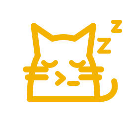

# Внешние компоненты

>  Обычно расширение приносит всё само; когда сети нет, приносите вы.

Отладчик [onec-debug-adapter](https://github.com/yellow-hammer/onec-debug-adapter), дерево метаданных [md-sparrow](https://github.com/yellow-hammer/md-sparrow) с [portable JRE 21](https://adoptium.net/temurin/releases/?version=21&package=jre), [OVM](https://github.com/oscript-library/ovm) и [Allure](https://github.com/allure-framework/allure2) не входят в VSIX: расширение загружает их из релизов в свой кэш при первом обращении и обновляет само. Ставить и настраивать для этого нечего.

## Что и откуда

| Компонент | Что скачать вручную | Путь к своему файлу | Загрузка |
|-----------|---------------------|---------------------|----------|
| Отладчик | архив [onec-debug-adapter](https://github.com/yellow-hammer/onec-debug-adapter/releases) для своей системы: `win-x64`, `linux-x64`, `osx-arm64`, `osx-x64`; внутри `OnecDebugAdapter.exe` | `components.path.adapter` | `components.autoload.adapter` |
| Дерево метаданных | файл `md-sparrow-*-all.jar` из [релизов](https://github.com/yellow-hammer/md-sparrow/releases) | `components.path.metadataJar` | `components.autoload.metadataJar` |
| Java для дерева | [Temurin JRE 21](https://adoptium.net/temurin/releases/?version=21&package=jre) для своей системы; внутри `bin/java` | `components.path.java` | `components.autoload.java` |
| OVM | файл `ovm.exe` из [релизов](https://github.com/oscript-library/ovm/releases) | `components.path.ovm` | `components.autoload.ovm` |
| Allure | архив `allure-<версия>.zip` из [релизов](https://github.com/allure-framework/allure2/releases); внутри `bin/allure.bat` | `components.path.allure` | `components.autoload.allure` |
| OneScript | архив [OneScript](https://github.com/EvilBeaver/OneScript/releases) для своей системы; внутри `bin/oscript.exe` | `components.path.oscript` | загрузки нет: [ставится через OVM](tools.md#установка-onescript) |

Настройки лежат в разделе **Внешние компоненты**. Заданный путь сильнее автозагрузки: расширение берёт указанный файл и в сеть за этим компонентом не идёт. Отладчик и JRE собраны под конкретную систему, остальные компоненты одинаковы везде.

## Обновление

Расширение работает с тем, что лежит в кэше, и не чаще раза в восемь минут спрашивает у GitHub последний стабильный релиз. Новая версия занимает место прежней, только когда скачается целиком.

Команда **Обновить внешние компоненты** в разделе **Зависимости** дерева **1С: Инструменты** показывает список с версиями: рядом с каждым видно, задан ли свой путь настройкой и не выключена ли автозагрузка. По умолчанию отмечены все. Выбранное загружается сразу и **вопреки этим настройкам**: если вы нажали «обновить», значит нужна свежая загрузка, даже когда обычная работа идёт со своей сборкой.

 Неудачная проверка обновления пишется в журнал и ничего не удаляет: загруженное остаётся в работе. Взять неоткуда только тот компонент, который не загружался ни разу, поэтому на закрытых машинах их приносят заранее.

## Машина без доступа к GitHub

Там, где сети нет или она закрыта политикой, каждый компонент скачивается на машине с интернетом по ссылке из таблицы выше, кладётся в любой каталог и подключается своей настройкой `components.path.*`. Устанавливать ничего не нужно, права администратора не требуются: архивы достаточно распаковать.

Чтобы расширение вовсе не обращалось к GitHub, выключите все `components.autoload.*`. Уже загруженное продолжит работать: с выключенной автозагрузкой берётся то, что лежит в кэше.

## OneScript без прав администратора

Команда **Установить OneScript** идёт за дистрибутивом в сеть через OVM, поэтому на закрытой машине берётся переносимая сборка из таблицы: ей не нужны ни установщик, ни права, распаковать можно в любой каталог с доступом на запись. На Linux и macOS файл называется `bin/oscript`.

Расширение подставит этот каталог первым в `PATH` дочерним процессам и новым терминалам, поэтому `vrunner` и `opm` пойдут в выбранную установку. Какая установка выбрана, видно в журнале расширения строкой `oscript: используется установка …`.

## Пакеты OneScript

Пакеты ставятся из файлов: скачайте `.ospx` с [hub.oscript.io](https://hub.oscript.io/) и выполните `opm install -f <файл.ospx>`. Ключ `-f` понимает маску, поэтому каталог с пакетами ставится одной командой.

 Зависимости пакета ищутся в хабе, а не в соседних файлах: переносите их вместе с основными пакетами, иначе установка остановится на первой недостающей. Что нужно проекту, перечислено в его `packagedef`.

## Токен GitHub

Лимит анонимных запросов считается по внешнему адресу, поэтому за общим адресом организации его выбирают чужие запросы, и загрузка падает с `API rate limit exceeded`. С учётной записью или токеном лимит выше.

Если вы вошли в GitHub в самом VS Code, расширение берёт эту сессию само: создавать токен не нужно. Права у сессии не запрашиваются, релизы и так публичные.

| Команда | Действие |
|---------|----------|
| **1С: Внешние компоненты: Указать токен GitHub** | спрашивает токен и сохраняет его |
| **1С: Внешние компоненты: Забыть токен GitHub** | удаляет сохранённый токен |

Токен нужен, когда сессии GitHub в редакторе нет или загрузка должна идти под другой учётной записью. Берётся на https://github.com/settings/tokens, `Generate new token (classic)`. Права не нужны: ни одной галочки scope ставить не надо, токен только делает запросы именными.

Хранится в SecretStorage: в файлы настроек не попадает и не синхронизируется.

Токен можно задать и переменной окружения `PLATFORM_TOOLS_GITHUB_TOKEN` — тогда нужен перезапуск VS Code, переменные окружения читаются при старте процесса.

Порядок источников: сохранённый командой токен, переменная окружения, сессия GitHub редактора. Что сработало, видно в журнале расширения строкой `Токен GitHub: …`.
