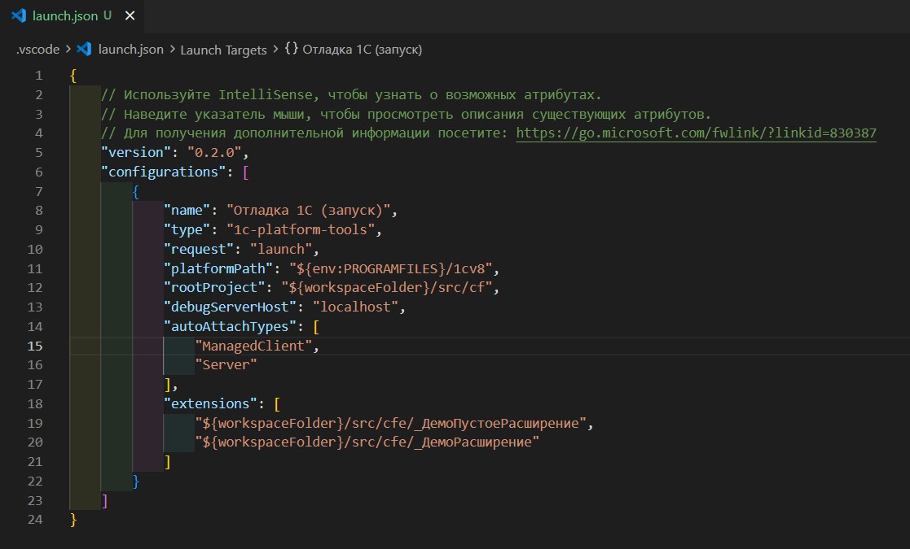

# Отладка 1С

Расширение регистрирует отладчик **1Cpt: Enterprise Debugger** (тип `1c-platform-tools`) и работает через [onec-debug-adapter](https://github.com/yellow-hammer/onec-debug-adapter) — адаптер скачивается и обновляется автоматически при первом запуске отладки.



## Содержание

- [Отладка 1С](#отладка-1с)
  - [Содержание](#содержание)
  - [Требования](#требования)
  - [Настройка](#настройка)
    - [1. Строка подключения — env.json](#1-строка-подключения--envjson)
    - [2. Конфигурация запуска — launch.json](#2-конфигурация-запуска--launchjson)
  - [Запуск и завершение сессии](#запуск-и-завершение-сессии)
  - [Предметы отладки (Debug targets)](#предметы-отладки-debug-targets)
  - [Точки останова](#точки-останова)
  - [Отладка расширений конфигурации](#отладка-расширений-конфигурации)
  - [Отладка внешних обработок и отчётов](#отладка-внешних-обработок-и-отчётов)
  - [Управление выполнением](#управление-выполнением)
  - [Просмотр переменных](#просмотр-переменных)
  - [Изменение значений переменных](#изменение-значений-переменных)
  - [Вычисление выражений](#вычисление-выражений)
  - [Замер производительности](#замер-производительности)
  - [Диагностика](#диагностика)
  - [Тонкая настройка адаптера](#тонкая-настройка-адаптера)

## Требования

- [.NET 8 Runtime](https://dotnet.microsoft.com/download/dotnet/8.0) — на нём работает адаптер отладки.
- Платформа 1С:Предприятие — для запуска клиента и локального сервера отладки (dbgs).
- Исходники конфигурации в формате конфигуратора (выгрузка XML), по умолчанию в `src/cf`.

## Настройка

### 1. Строка подключения — env.json

В корне проекта в `env.json` укажите подключение к информационной базе:

```json
{
  "default": {
    "--ibconnection": "/F./build/ib"
  }
}
```

- `/F<путь>` — файловая ИБ (относительный путь достраивается от корня проекта);
- `/S<сервер>\<база>` — серверная ИБ.

Для автоматического входа в предприятие там же можно указать `--db-user` и `--db-pwd`.

### 2. Конфигурация запуска — launch.json

Откройте панель **Run and Debug** (`Ctrl+Shift+D`) → **create a launch.json file** → выберите **1Cpt: Enterprise Debugger**.

Расширение сгенерирует конфигурацию по настройкам путей проекта (`1c-platform-tools.paths.*`):

```json
{
  "name": "Отладка 1С (запуск)",
  "type": "1c-platform-tools",
  "request": "launch",
  "platformPath": "${env:PROGRAMFILES}/1cv8",
  "rootProject": "${workspaceFolder}/src/cf",
  "debugServerHost": "localhost",
  "autoAttachTypes": ["ManagedClient", "Server"],
  "extensions": ["${workspaceFolder}/src/cfe/МоёРасширение"],
  "externalFilesSrc": ["${workspaceFolder}/src/epf", "${workspaceFolder}/src/erf"],
  "externalFilesBuilds": ["${workspaceFolder}/build/out/epf", "${workspaceFolder}/build/out/erf"]
}
```

| Параметр                             | Назначение                                                                                                                                                                                                                         |
|--------------------------------------|------------------------------------------------------------------------------------------------------------------------------------------------------------------------------------------------------------------------------------|
| `rootProject`                        | каталог исходников конфигурации                                                                                                                                                                                                    |
| `extensions`                         | каталоги исходников расширений (по одному на расширение)                                                                                                                                                                           |
| `platformPath`                       | каталог с установленными версиями платформы 1С                                                                                                                                                                                     |
| `platformVersion`                    | конкретная версия платформы (необязательно — берётся последняя)                                                                                                                                                                    |
| `debugServerHost`, `debugServerPort` | адрес HTTP-сервера отладки для серверной ИБ (порт по умолчанию 1550); для файловой ИБ сервер отладки запускается автоматически                                                                                                     |
| `autoAttachTypes`                    | какие предметы отладки подключать автоматически: `ManagedClient`, `Client`, `WebClient`, `MobileClient`, `Server`, `ServerEmulation`, `Job` (фоновое задание), `JobFileMode`, `WebService`, `HttpService`, `OData`, `ComConnector` |
| `user`, `password`                   | автовход в предприятие (если не заданы — берутся `--db-user`/`--db-pwd` из env.json)                                                                                                                                               |
| `externalFilesSrc`                   | каталоги исходников внешних обработок и отчётов                                                                                                                                                                                    |
| `externalFilesBuilds`                | каталоги собранных `.epf`/`.erf` (обязательны для точек останова во внешних файлах)                                                                                                                                                |

Строка подключения в launch.json не указывается — она всегда берётся из `env.json`.

## Запуск и завершение сессии

1. Откройте **Run and Debug** (`Ctrl+Shift+D`).
2. Выберите конфигурацию **Отладка 1С (запуск)** и нажмите **F5**.

Что произойдёт: для файловой ИБ адаптер сам запустит локальный сервер отладки (dbgs) и клиент 1С:Предприятие; при заданных учётных данных вход выполнится автоматически. Предметы отладки из `autoAttachTypes` подключаются сами.

Завершение — **Shift+F5** или кнопка ⏹ на панели отладки. Сессия закрывается, клиент 1С продолжает работать.

Изменение `autoAttachTypes` в launch.json во время активной сессии применяется сразу, без перезапуска.

## Предметы отладки (Debug targets)

Во время сессии в панели **Run and Debug** появляется вид **Debug targets** — список доступных, но не подключённых предметов отладки (тип, сеанс, пользователь).

- Кнопка **Connect** в заголовке вида подключает выбранный предмет вручную — например, фоновое задание, если `Job` не входит в `autoAttachTypes`.
- Список обновляется автоматически при появлении новых сеансов.

## Точки останова

Точка ставится кликом слева от номера строки в `.bsl`-файле или клавишей **F9**.

**Автоперенос на исполняемую строку.** Точка, поставленная на пустой строке, комментарии, директиве (`&НаКлиенте`) или команде препроцессора (`#Если`), автоматически переносится вниз на ближайшую исполняемую строку — маркер сразу сдвигается в редакторе. Если исполняемых строк ниже нет (хвост модуля), точка серверу не отправляется и помечается как непроверенная.

**Условная точка.** ПКМ по области точек → **Add Conditional Breakpoint** (Добавить условную точку останова):

- **Expression** — выражение на языке 1С (например `Сумма > 1000`); останов произойдёт, только когда оно Истина;
- **Hit Count** — число проходов через точку, по достижении которого произойдёт останов.

**Точка логирования (logpoint).** ПКМ по области точек → **Add Logpoint**. Текст сообщения выводится в **Debug Console** без остановки выполнения; выражения подставляются в фигурных скобках:

```txt
Обработка {Ссылка}: сумма = {Объект.Сумма}
```

У существующей точки всё это редактируется через ПКМ по маркеру → **Edit Breakpoint**.

## Отладка расширений конфигурации

Укажите каталоги исходников расширений в `extensions`. Точки ставятся в модулях расширения как обычно.

Дополнительно работает **зеркалирование**: если процедура базовой конфигурации перехвачена расширением (`&Вместо`, `&ИзменениеИКонтроль`), точка, поставленная в базовом модуле, автоматически дублируется в процедуру-заместитель — иначе она бы молча не срабатывала, потому что базовый код не выполняется. Для `&После`/`&Перед` зеркальная точка ставится на первую строку дополняющей процедуры.

## Отладка внешних обработок и отчётов

Сервер отладки 1С адресует внешние файлы по пути к собранному `.epf`/`.erf`, поэтому нужны и исходники, и собранный файл:

1. Исходники — в каталогах из `externalFilesSrc`.
2. Собранный файл — в каталоге из `externalFilesBuilds`; имя файла должно совпадать с именем каталога исходников (`src/epf/МояОбработка` → `build/out/epf/МояОбработка.epf`). Собрать можно командой **Собрать внешнюю обработку** / **Собрать внешний отчет** (дерево **Инструменты 1С** → **Внешние файлы**).
3. Точки ставятся прямо в исходниках (`.bsl` модулей и форм обработки).
4. Откройте обработку в предприятии — остановы работают как в конфигурации: переменные, шаги, вычисления.

Если собранного файла нет, точки этой обработки помечаются непроверенными и серверу не отправляются.

## Управление выполнением

| Действие                            | Клавиша     |
|-------------------------------------|-------------|
| Продолжить                          | `F5`        |
| Шаг через (не заходя в вызов)       | `F10`       |
| Шаг внутрь                          | `F11`       |
| Шаг наружу (до выхода из процедуры) | `Shift+F11` |
| Остановить сессию                   | `Shift+F5`  |

**Остановка по ошибке.** В панели **Run and Debug** → раздел **Breakpoints** включите флажок **Остановка по ошибке** — выполнение будет останавливаться при исключениях времени выполнения. ПКМ по флажку → **Edit Condition** позволяет задать подстроку: останов только если текст ошибки её содержит.

## Просмотр переменных

При останове панель **Variables** показывает переменные текущего кадра стека.

- Составные значения (структуры, массивы, таблицы значений, объекты) раскрываются стрелкой слева.
- **Соответствие** раскрывается в пары «ключ = значение»; значение-объект раскрывается дальше.
- Панель **Call Stack** показывает стек вызовов — клик по кадру переключает контекст переменных. Клиент и сервер — отдельные элементы списка (предметы отладки), у каждого свой стек.
- **Показать значение в окне**: ПКМ по переменной в Variables или Watch → **Показать значение в окне** — полное (неусечённое) значение открывается в отдельной вкладке редактора. Удобно для длинных строк, XML, JSON.

## Изменение значений переменных

1. Остановитесь на точке.
2. В панели **Variables** дважды кликните по значению переменной (или ПКМ → **Set Value**, или `F2`).
3. Введите выражение на языке 1С — `Истина`, `123`, `"строка"`, `ТекущаяДата()`, `Новый Массив` — и нажмите `Enter`.

Выражение вычисляется на сервере отладки, поэтому доступен весь контекст текущего кадра. Изменять можно и элементы коллекций (элемент массива, значение структуры) — тем же способом на вложенном элементе.

## Вычисление выражений

- **Watch**: панель **Watch** → **+** → выражение 1С. Пересчитывается на каждом останове и шаге.
- **Наведение**: при останове наведите курсор на переменную в коде — всплывёт её значение.
- **Debug Console**: внизу в консоли отладки можно ввести любое выражение 1С и получить результат (только при останове — нужен контекст кадра).

## Замер производительности

Показывает, сколько раз и как долго выполнялась каждая строка кода — аналог замера производительности Конфигуратора.

1. Запустите сессию отладки.
2. На панели отладки (между «шагом наружу» и «перезапуском») нажмите кнопку замера (значок спидометра) — или команду **1C: Отладка: Начать замер производительности**. В статус-баре появится «Замер производительности…».
3. Выполните в 1С исследуемые действия (открытие формы, проведение документа).
4. Нажмите ту же кнопку (теперь значок остановки) — или **1C: Отладка: Закончить замер производительности**.

Результаты:

- **Таблица «Замер производительности»** откроется автоматически: модуль, строка, код, количество выполнений, время (с вложенными вызовами и без), доля от общего времени, признак серверного вызова. Клик по заголовку сортирует, поле фильтра ищет по модулю и коду, **двойной клик по строке открывает модуль на этой строке**.
- **Колонка слева от кода** в модулях: `410 × 8.3 мс · 0.6 %` (⚡ — был серверный вызов). Подробности — при наведении.
- **Статус-бар** показывает общее время; клик открывает таблицу повторно (или команда **1C: Отладка: Показать результаты замера производительности**).

Скрыть всё — команда **1C: Отладка: Скрыть результаты замера производительности**. Замер автоматически выключается при завершении сессии — «забытый» замер не останется висеть на сервере отладки.

## Диагностика

Логи расширения и адаптера пишутся в **Output** → канал **1C: Platform Tools**, компонент отладки помечен `[dap]`.

При настройке `1c-platform-tools.logLevel: "debug"` адаптер передаёт подробную трассировку: отправляемые точки останова, переносы строк, остановы, замер. При сообщении об ошибке отладки включите `debug`, повторите сценарий и приложите вывод к issue.

## Тонкая настройка адаптера

Необязательные параметры launch.json для нестандартных окружений:

| Параметр                 | По умолчанию     | Назначение                                                                                                                                     |
|--------------------------|------------------|------------------------------------------------------------------------------------------------------------------------------------------------|
| `calcWaitingTimeMs`      | 100              | время ожидания результата вычислений сервером отладки (25–5000); увеличьте на медленных серверах, если переменные и выражения приходят пустыми |
| `variablesRetryDelaysMs` | `[50, 100, 150]` | паузы повторов при пустом списке локальных переменных сразу после останова                                                                     |
| `debugPollMinDelayMs`    | 25               | минимальная пауза опроса сервера отладки                                                                                                       |
| `debugPollMaxDelayMs`    | 200              | максимальная пауза опроса (адаптивный бэкофф при простое)                                                                                      |
