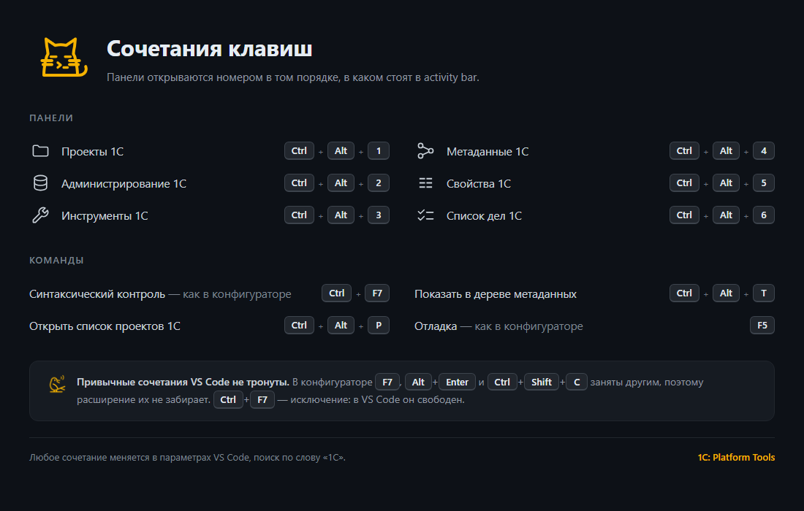

# Сочетания клавиш

>  Ни одно привычное сочетание VS Code не перекрыто.



## Панели

Панели открываются номером в том же порядке, в каком они стоят в activity bar. Одно правило вместо шести разных сочетаний.

| Сочетание | Панель |
| --- | --- |
| <kbd>Ctrl</kbd>+<kbd>Alt</kbd>+<kbd>1</kbd> | 1С: Проекты |
| <kbd>Ctrl</kbd>+<kbd>Alt</kbd>+<kbd>2</kbd> | 1С: Администрирование |
| <kbd>Ctrl</kbd>+<kbd>Alt</kbd>+<kbd>3</kbd> | 1С: Инструменты |
| <kbd>Ctrl</kbd>+<kbd>Alt</kbd>+<kbd>4</kbd> | 1С: Метаданные |
| <kbd>Ctrl</kbd>+<kbd>Alt</kbd>+<kbd>5</kbd> | 1С: Свойства |
| <kbd>Ctrl</kbd>+<kbd>Alt</kbd>+<kbd>6</kbd> | 1С: Список дел |

На macOS вместо <kbd>Ctrl</kbd> — <kbd>Cmd</kbd>.

## Команды

| Сочетание | Команда | В конфигураторе |
| --- | --- | --- |
| <kbd>Ctrl</kbd>+<kbd>F7</kbd> | Синтаксический контроль | то же сочетание |
| <kbd>Ctrl</kbd>+<kbd>Alt</kbd>+<kbd>P</kbd> | Открыть список проектов | — |
| <kbd>Ctrl</kbd>+<kbd>Alt</kbd>+<kbd>T</kbd> | Показать в дереве | — |
| <kbd>Ctrl</kbd>+<kbd>S</kbd> | Сохранить изменения формы | — |

Отладка идёт штатными сочетаниями VS Code, и они совпадают с конфигуратором: <kbd>F5</kbd> начинает отладку, <kbd>Ctrl</kbd>+<kbd>F5</kbd> запускает без отладки.

## Почему не все сочетания как в конфигураторе

 Три сочетания конфигуратора заняты в VS Code: <kbd>F7</kbd> ведёт к следующему отличию в сравнении файлов, <kbd>Alt</kbd>+<kbd>Enter</kbd> выделяет все совпадения поиска, <kbd>Ctrl</kbd>+<kbd>Shift</kbd>+<kbd>C</kbd> открывает внешний терминал. Расширение их не трогает: молча отобрать у редактора привычное действие хуже, чем не дать сочетание вовсе.

<kbd>Ctrl</kbd>+<kbd>F7</kbd> — исключение: в VS Code он свободен, поэтому аналогия с конфигуратором ничего не стоит.

## Свои сочетания

 Любое сочетание меняется в **Файл → Параметры → Сочетания клавиш**, поиск по слову `1C`. Там же назначаются сочетания командам, у которых их нет: например загрузке конфигурации или запуску Предприятия.

Если привычка из конфигуратора важнее, <kbd>F7</kbd> вешается на обновление конфигурации БД вручную — в `keybindings.json`:

```jsonc
{
  "key": "f7",
  "command": "1c-platform-tools.infobase.updateDb",
  "when": "1c-platform-tools.is1CProject && !inDiffEditor"
}
```
