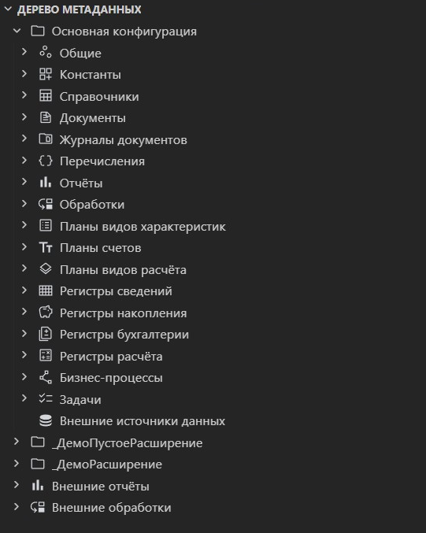

# 1С: Метаданные

>  Дерево строит md-sparrow, portable JRE к нему скачивается сам.

Панель **«1С: Метаданные»** показывает дерево выгрузки конфигурации, расширений и внешних артефактов, позволяет создавать и редактировать объекты. Работает через [md-sparrow](https://github.com/yellow-hammer/md-sparrow) — библиотека и portable JRE скачиваются автоматически при первом открытии панели.

Внутреннее устройство md-sparrow (Md Classes, XML-контракт, структура CLI) описано в репозитории библиотеки.

## Что делает расширение

- показывает дерево метаданных по `src/cf`, `src/cfe`, `src/erf`, `src/epf` (тестовые расширения из `tests/cfe` не показываются: они не часть решения);
- собирает выгрузку в файл: у конфигурации, расширения, внешнего отчёта и обработки свой пункт **Собрать**, а на группах «Внешние отчёты» и «Внешние обработки» он собирает всё содержимое разом;
- выполняет операции из UI: обновление дерева, создание объектов, редактирование свойств, мутации дочерних узлов;
- ищет объекты по имени и отбирает дерево по подсистемам.

Панель состоит из плашек **Поиск**, **Фильтры**, **Дерево** и **Помощь и поддержка**. По умолчанию развёрнуто только дерево.

## Первый запуск

1. Откройте панель **«1С: Метаданные»**.
2. При настройках по умолчанию расширение автоматически:
   - скачает portable JRE 21;
   - скачает `md-sparrow-*-all.jar` из последнего стабильного релиза `yellow-hammer/md-sparrow`.

Скачивание и обновление не требуют настройки. Переопределить поведение можно в разделе настроек **Внешние компоненты** (`1c-platform-tools.components.*`):

| Настройка                            | Назначение                                                                |
|--------------------------------------|---------------------------------------------------------------------------|
| `path.metadataJar`                    | путь к локальной сборке `md-sparrow-*-all.jar` вместо загрузки с GitHub   |
| `path.java`                     | путь к своей `java` вместо portable JRE                                   |
| `autoload.metadataJar`, `autoload.java` | выключают автозагрузку, если пути выше не заданы                          |

Загруженные компоненты обновляются сами: расширение работает с тем, что лежит в кэше, и не чаще раза в восемь минут спрашивает у GitHub последний стабильный релиз. Если версия там новее, компонент скачивается заново. Без сети остаётся уже загруженный, ошибка проверки пишется только в журнал.

Принудительно переустановить компоненты — команда **Обновить внешние компоненты** в разделе **Зависимости** дерева **1С: Инструменты**. Выбранные в списке компоненты загружаются заново сразу.

Если GitHub отдаёт ошибку лимита запросов, войдите в GitHub в самом VS Code или задайте токен — см. [Токен GitHub](tools.md#токен-github).

## Поиск по дереву

Плашка **Поиск** содержит поле над деревом: по мере ввода в дереве остаются объекты, имя которых содержит подстроку. Пустое поле снимает отбор. Поиск не разворачивает дерево целиком, поэтому на больших конфигурациях остаётся быстрым.

Кнопка **Свернуть** в шапке дерева схлопывает все узлы.

## Переход к объекту из файла

Команда **«1С: Метаданные: Показать в дереве»** (Ctrl+Alt+T) находит в дереве объект, которому принадлежит открытый файл, и выделяет его. Она же лежит в контекстном меню редактора, вкладки и проводника.

Если объект скрыт поиском или отбором по подсистемам, команда предложит сбросить отбор, а не промолчит.

Работает от любого файла выгрузки, а не только от XML объекта. Форма, команда и макет лежат в выгрузке одинаково - `<Объект>/<Раздел>/<Имя>.xml` рядом с каталогом содержимого, - поэтому и описание, и содержимое, и модуль ведут к своему узлу в дереве. Модули самого объекта ведут к объекту, `Configuration.xml` - к корню выгрузки. Если дерево ещё не читалось, команда прочитает его сама.

## Фильтр по подсистемам

Плашка **Фильтры** показывает дерево подсистем конфигурации с флагами. Отметка применяется сразу: в дереве метаданных остаются объекты, входящие в состав отмеченных подсистем. Отмеченных может быть несколько, их составы объединяются.

Два переключателя расширяют состав отбора:

| Переключатель                            | Что добавляет                                                        |
|------------------------------------------|----------------------------------------------------------------------|
| Включать объекты подчинённых подсистем   | состав всех подсистем ниже отмеченной                                |
| Включать объекты родительских подсистем  | состав подсистем выше отмеченной по ветке                            |

Поле поиска над деревом подсистем ищет по их именам. **Очистить фильтр** снимает все отметки, **Свернуть** схлопывает дерево подсистем.

Отдельная команда **Фильтр по подсистеме** в контекстном меню подсистемы в дереве метаданных отбирает по ней сразу.

## Редактирование свойств объекта

**Свойства** в контекстном меню открывают вкладку с формой объекта. Пункт один на все узлы дерева: конфигурация, расширение, объект, внешний отчёт и обработка открываются одинаково. Вкладка на объект тоже одна - повторный вызов покажет уже открытую, соседний объект откроет свою.

Вкладки повторяют конфигуратор: **Основные**, **Данные**, вкладка сути вида (адресация, компоновка, субконто, расчёт, движения, регистрируемые документы, обмен данными), **Формы**, **Команды**, **Макеты**, **Ввод на основании**. Чего у вида не бывает, того и не показывается.

Правки копятся в панели и уходят в файлы по кнопке **Сохранить**.

Расширение правит XML точечно: меняются только затронутые строки, остальной файл, включая форматирование и порядок элементов, остаётся как был. Это держит diff в Git читаемым.

 Формат выгрузки берётся из самой конфигурации: поддержаны все версии от 2.10 до 2.21. Свойство, которого в конкретной версии формата нет, панель не показывает и в файл не пишет. Варианты выпадающих списков панель тоже спрашивает у формата, поэтому выбрать значение, которого версия формата не знает, нельзя. Подписи того, чего в формате нет - виды объектов, права ролей, группы командного интерфейса, стандартные команды - тоже приходят от md-sparrow: своих словарей расширение не держит.

### Состав объекта

Реквизиты, табличные части, измерения, ресурсы, значения перечисления, команды и признаки учёта ведутся одинаково: добавить, переименовать, дублировать, удалить, переставить, поправить синоним и тип. Список стоит на своей вкладке: реквизиты и табличные части на «Данных», команды на «Командах», макеты на «Макетах».

Те же действия есть в дереве: **Добавить** на разделе состава, **Переименовать**, **Дублировать** и **Удалить** на самом узле.

 Новый элемент создаётся со строковым типом: платформа требует тип всегда, пустым он не останется. У команды объекта дублирования нет, а её модуль переезжает и удаляется вместе с ней.

### Формы

На вкладке **Формы** щелчок по имени открывает форму, крестик удаляет её вместе с файлами, **+ Форма…** создаёт пустую управляемую форму из эталона платформы. То же самое есть в дереве на разделе «Формы» и на самой форме.

### Подсистемы, права и составы

| Что открыть | Где | Что можно |
|-------------|-----|-----------|
| Подсистемы объекта | вкладка «Подсистемы» | отметить участие флажками, запись идёт в состав подсистем |
| Права роли | вкладка «Права» у роли | кросс-таблица «объекты × права», флаги прав по умолчанию, фильтр по имени и виду |
| Командный интерфейс | вкладка у подсистемы или пункт меню | видимость команд, размещение по группам, порядок команд, подсистем и групп |
| Состав | вкладка «Состав» | дерево с флажками у подсистемы, функциональной опции и её параметра, общего реквизита, последовательности, плана обмена |

Права ведут себя как в конфигураторе: выданное право тянет зависимые, снятие базового снимает зависимые. По умолчанию видны объекты с выданными правами, флажок «Все объекты» показывает всю конфигурацию.

 Состав критерия отбора пока только снимается: выбор новых ссылок в дереве кандидатов не предлагается.

### Конфигурация и расширение

У конфигурации перечислимые свойства подписаны словарём формата, назначения использования отмечаются флажками, основные роли ведутся плашками: крестик убирает роль, **+ Роль…** подбирает из ролей конфигурации.

### Когда правка закрыта

Происхождение объекта видно плашкой в шапке панели: «Заимствованный» у объекта расширения, «На поддержке» у объекта поставщика с поставщиком и версией в подсказке. Закрытый объект открывается только на просмотр: поля недоступны, кнопки записи нет, причина написана строкой над вкладками. Так же ведут себя свойства конфигурации, просмотр формы и палитра свойств.

В дереве пункты меню остаются на месте и при запрете: контекстное меню VS Code не умеет показывать пункт недоступным, поэтому вызов правки отвечает подсказкой, что делать дальше.

Заимствованные объекты расширений правятся в расширяемой конфигурации, а в панели открываются только на просмотр. В дереве такой объект помечен жёлтым кружком с буквой **А** в правом верхнем углу пиктограммы.

## Поддержка поставщика

Работа с поддержкой включена по умолчанию. Настройка `metadata.supportEnabled` её выключает: тогда выгрузка правится так, будто поставки нет, признаков в дереве не появляется, отказов в правке тоже.

Возможность изменения конфигурации включают в конфигураторе. В этот момент он кладёт рядом с правилами файл поставки `Ext/ParentConfigurations/<Имя поставки>.cf`; выгрузка, сделанная на полной поддержке, содержит только сами правила. Расширение считает возможность изменения включённой, когда действуют правила и файл поставки на месте. Пока это не так, конфигурация закрыта целиком: правило не меняется ни у объекта, ни у корня, правка объектов отклоняется.

 Поднять флаг в файле правил мимо конфигуратора мало: без файла поставки платформа такую выгрузку не загрузит. Поэтому расширение такое состояние считает выключенным и правила в нём не правит.

Состояние видно в дереве признаками на пиктограмме, по одному на угол:

| Признак | Угол | Что означает |
|---------|------|--------------|
| Бледно-жёлтый квадрат | слева снизу | объект на поддержке |
| Янтарный замок | справа сверху | правило «не редактируется» |
| Красный круг с чертой | справа снизу | возможность изменения не включена, доступно только снятие с поддержки |

Круг с чертой стоит на корне конфигурации и уходит, как только конфигуратор включит возможность изменения; замок после этого остаётся, пока у субъекта правило «не редактируется». Те же признаки идут на разделы, узлы состава и листья внутри подсистем. В свойствах конфигурации состояние показано плашкой в шапке, а причина запрета - строкой над вкладками.

Правило ставится пунктом **Режим поддержки** любому субъекту: самой конфигурации, объекту, его форме, макету, реквизиту, табличной части, измерению, ресурсу, значению перечисления и команде. Правила и порядок как в окне конфигуратора:

| Правило | Что означает |
|---------|--------------|
| Объект поставщика не редактируется | остаётся на поддержке, правка закрыта |
| Объект поставщика редактируется с сохранением поддержки | правка разрешена, поддержка сохраняется |
| Объект поставщика снят с поддержки | поставщик больше не управляет объектом |

Следом спрашивается область: без подчинённых объектов или с ними. У конфигурации подчинённые - вся выгрузка, у объекта - его формы, макеты и элементы. Правило корня открывает свойства конфигурации и добавление объектов.

 В файле правил меняются только цифры режимов, остальное содержимое остаётся прежним побайтово. Правка идёт поверх снимка правил, показанного в дереве: если файл успел измениться конфигуратором или соседней сессией, запись отклоняется с просьбой обновить дерево.

Пункт **Снять с поддержки** на конфигурации удаляет правила вместе с поставками из `Ext/ParentConfigurations`: с поддержки снимаются все объекты, выгрузка правится свободно, обновление от поставщика становится недоступно.

## Открытие по клику

Клик по объекту в дереве (или двойной клик, если так настроено в VS Code) вызывает ту же команду, что основной пункт его меню:

- общая форма — **Открыть форму**;
- общий модуль, HTTP-сервис, Web-сервис — **Открыть модуль**;
- остальные объекты — **Свойства**.

Форма внутри справочника или документа открывается кликом по узлу формы. Второй клик по тому же объекту показывает уже открытую вкладку.

## Открытие модулей объектов

В контекстном меню объекта дерева доступны пункты открытия его модулей. Набор пунктов зависит от типа объекта и **всегда стабилен** (не зависит от наличия файла на диске):

| Пункт меню                       | Файл (`<Объект>/Ext/…`)     | Типы объектов                                                                                          |
|----------------------------------|-----------------------------|-------------------------------------------------------------------------------------------------------|
| Открыть модуль объекта           | `ObjectModule.bsl`          | справочники, документы, отчёты, обработки, планы видов характеристик/счетов/расчёта, планы обмена, бизнес-процессы, задачи |
| Открыть модуль менеджера         | `ManagerModule.bsl`         | те же + журналы документов, перечисления, регистры, константы, хранилища настроек, критерии отбора |
| Открыть модуль набора записей    | `RecordSetModule.bsl`       | регистры (сведений/накопления/бухгалтерский/расчёта)                                                    |
| Открыть модуль менеджера значения| `ValueManagerModule.bsl`    | константы                                                                                               |
| Открыть модуль                   | `Module.bsl`                | общие модули, HTTP-сервисы, Web-сервисы                                                                 |
| Открыть модуль формы             | `Ext/Form/Module.bsl`       | общие формы и формы объектов                                                                            |

Если файла модуля ещё нет, он создаётся пустым (UTF-8 BOM) и сразу открывается — конфигуратор подхватывает модуль по факту наличия файла, отдельная регистрация в XML не требуется.

## Открытие XML

**Открыть XML** есть у каждого узла, у которого в выгрузке свой файл: у конфигурации и расширения это `Configuration.xml`, у объекта - его XML, у внешнего отчёта и обработки - их файл.

«Свойства» на форме и макете открывают их собственное описание той же вкладкой, что у объекта: имя, синоним, тип формы. У формы файлов два, и они разведены: **Открыть XML** показывает описание формы (`<Объект>/Forms/<Форма>.xml` - имя, синоним, тип), **Открыть XML содержимого** - саму форму с элементами и реквизитами (`Ext/Form.xml`). У общей формы описание лежит в её собственном XML, а содержимое - в `<Форма>/Ext/Form.xml`.

## Просмотр формы

Клик по форме в дереве метаданных открывает её вкладкой: дерево элементов, схематичное превью и данные формы (реквизиты, команды, параметры, обработчики). Свойства выделенного элемента показывает панель **«1С: Свойства»**.

Внизу вкладки переключатель **«Форма» / «Модуль»**, как в конфигураторе: «Модуль» открывает `Ext/Form/Module.bsl` соседней вкладкой редактора, с подсветкой и подсказками языка. Если модуля ещё нет, он создаётся пустым.

Закладки списков внизу плашек, как в конфигураторе: у элементов формы - «Элементы», у данных - «Реквизиты», «Команды», «Параметры», «События». Выделение синхронно в дереве и на превью. Клик по обработчику события открывает модуль формы на нужной процедуре.

Превью подписывает элементы так же, как платформа: заголовок элемента, а если его нет - синоним источника. У поля это реквизит формы или реквизит объекта (включая стандартный), у кнопки - команда формы или команда объекта, у переключателя и флажка - представление значения из списка выбора. Свойства, не записанные в файл, берутся по умолчанию из модели формата, поэтому группа без записанной группировки раскладывается горизонтально - как в конфигураторе, а не вертикально.

## Схема компоновки данных

Пункт **Открыть схему компоновки** на макете вида «Схема компоновки данных» (в том числе общем) открывает её вкладкой. Разделы разложены по закладкам в порядке конфигуратора: наборы данных с источниками, полями и запросом, связи наборов, вычисляемые поля, ресурсы, параметры с типом и значением по умолчанию, варианты настроек и вложенные схемы. Пустых закладок нет, кроме вычисляемых полей: там же их и добавляют. Текст запроса набора правится прямо на вкладке и сохраняется своей кнопкой; вычисляемое поле добавляется по пути к данным, выражению и заголовку. После каждой правки md-sparrow перечитывает схему моделью формата, битый файл не записывается.

## Палитра свойств

Свойства живут в отдельной панели **«1С: Свойства»** со своим значком на панели действий; открывает её пользователь, сама она не всплывает. Если значка не видно, панель открывает команда **«1С: Свойства: Открыть панель»**. Панель можно перетащить куда удобно, в том числе в правую боковую, - тогда форма и свойства видны одновременно.

Устроена она как палитра свойств конфигуратора: сверху поиск и переключатель «А-Я» (список без групп, по алфавиту), в заголовке имя и вид выделенного, внизу пояснение к выбранной строке. Вкладок нет: группы всех вкладок панели-вкладки идут одним списком, одноимённые сливаются.

Наполняется тем, что выделено: элементом формы на превью или узлом дерева метаданных. Показывает любой узел, у которого свойства есть: конфигурацию и расширение, объект, внешний отчёт и обработку, форму и макет (их свойства лежат в собственных файлах описания) и любой узел состава - реквизит, табличную часть и её реквизит, значение перечисления, измерение, ресурс, команду, графу, признак учёта, реквизит адресации, перерасчёт, операцию, шаблон URL, канал, таблицу, куб, функцию. Пока панель закрыта, ничего не читается и не всплывает, фокус она не забирает; свойства выделенного элемента формы выделение в дереве не подменяет, пока панель не открыта.

У элемента формы виден весь набор свойств его вида, а не только записанные в файле: состав приходит от md-sparrow из модели формата, незаполненные показываются со значением по умолчанию, и в пояснении к строке видно, записано свойство или подставлено.

### Правка

Значения правятся прямо в строках: поле, флажок, выпадающий список. Изменённые строки выделяются, а записываются все разом по кнопке **«Записать»** внизу панели. Там, где править нечего, кнопки нет.

Значение, совпавшее со значением по умолчанию, убирается из файла - платформа его туда и не пишет. Правится только сам узел свойства, остальной файл остаётся как был; после записи форма перечитывается, и вкладка с превью обновляется.

Что палитра не правит, видно по самой строке. Имя и идентификатор платформа держит атрибутами, переименование задевает ссылки и делается в дереве, а составные значения - список ссылок, подбор типа, ссылку на модуль, шрифт и цвет - правит панель-вкладка: ей хватает ширины. Палитра её не заменяет, а дополняет компактным видом.

## Создание конфигурации и расширения

Кнопка **«Создать»** на панели дерева метаданных открывает список из двух пунктов.

**Создать новую конфигурацию** - пустая выгрузка в каталоге конфигурации проекта. Если выгрузка
там уже есть, команда предупредит: её содержимое будет удалено.

**Создать новое расширение** - каркас расширения в каталоге расширений проекта. Спрашивает имя,
префикс имён объектов (можно оставить пустым, платформа так и делает) и назначение: дополнение,
адаптация или исправление. Версия формата и режимы совместимости берутся из выгрузки конфигурации,
поэтому расширение подходит к ней сразу: платформа не примет расширение, режим совместимости
которого выше, чем у расширяемой конфигурации.

Каркас в обоих случаях собирается из эталона выгрузки нужной версии формата, снятого с платформы,
а не пишется по памяти. Пустое расширение состоит из роли по умолчанию, как и у конфигуратора.

## Сборка

**Собрать** в контекстном меню собирает выбранный узел: основную конфигурацию в `.cf`, расширение в свой `.cfe`, внешнюю обработку или отчёт — в один `.epf` или `.erf`.

## Проверка выгрузки

Команда **«Проверить выгрузку»** отвечает на вопрос, цела ли выгрузка: состав против файлов на
диске в обе стороны, повторы и неизвестные типы, порядок типов по схеме формата, единая версия
формата у объектов, ссылки вида `Role.ПолныеПрава`, расхождения `ConfigDumpInfo.xml`.

Запускается двумя способами:

- значок с галочкой на панели дерева метаданных - проверяет конфигурацию и все расширения проекта;
- правый клик на узле «Основная конфигурация» или на расширении - проверяет только его.

Находки уходят в панель **«Проблемы»**, каждая на свой файл: объявленный без файла объект садится
на `Configuration.xml` выгрузки, остальные - на файл объекта. Номеров строк проверка не даёт,
поэтому находка ставится в начало файла. Беспорядок, который платформа переживёт - лишний файл,
неизвестный тип, нарушенный порядок, расхождения служебного файла версий - показывается
предупреждением, остальное ошибкой.

Повторный запуск снимает прежние находки по этой выгрузке, так что список не копится.

Проверку выполняет md-sparrow, поэтому она работает при подключённом компоненте дерева
метаданных.

## Сохранение

Правки в панелях свойств применяются кнопкой **Сохранить** внизу панели или сочетанием Ctrl+S, когда панель в фокусе. Кнопка **Отменить** возвращает значения к сохранённым.
