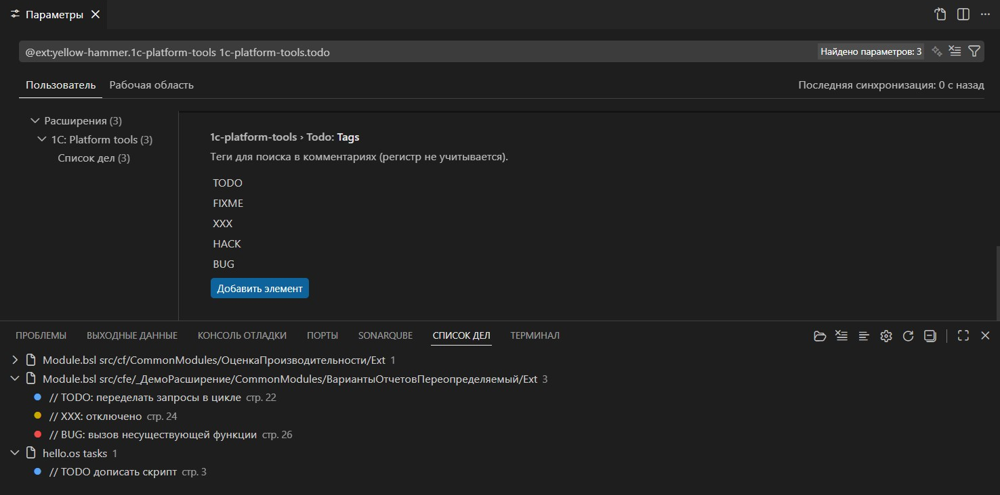

# Проекты 1С

Панель **Проекты 1С** в activity bar помогает быстро переключаться между рабочими папками с проектами 1С. Доступна даже без открытого проекта.



## Поиск проектов

Вкладка **Все проекты** сканирует указанные папки и ищет каталоги с `packagedef`. Папки поиска задаются настройкой:

```json
{
  "1c-platform-tools.projects.baseFolders": [
    "~/projects",
    "D:/work/1c"
  ]
}
```

Если `baseFolders` пуст, вкладка «Все проекты» ничего не найдёт — избранные проекты при этом можно добавлять вручную из открытой рабочей папки. Лишние подпапки исключаются через `projects.ignorePatterns` (например `node_modules`, `out`), глубина сканирования — `projects.maxDepthRecursion`.

## Избранное и теги

- **Избранное** хранит выбранные проекты; отображение — списком или по тегам.
- Теги (например «Личное», «Работа») задаются настройкой `projects.tags` и назначаются проектам из контекстного меню.

## Быстрое переключение

- Статусная строка показывает текущий проект; клик открывает QuickPick выбора (Избранное → Все проекты).
- Команда **Открыть список проектов 1С** — из палитры или по `Ctrl+Alt+P` / `Cmd+Alt+P`.
- Поведение открытия (новое окно, подтверждение, фильтр по полному пути) настраивается ключами `1c-platform-tools.projects.*`.

## Синхронизация

`projects.projectsLocation` — папка для хранения `projects.json` (избранное и теги); укажите синхронизируемый каталог, чтобы переносить список между машинами. `projects.cacheBetweenSessions` ускоряет открытие панели за счёт кэша результатов сканирования.
