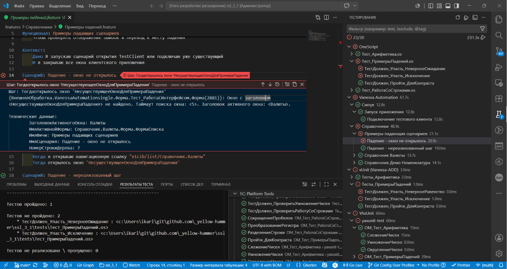

# Тестирование

>  Прогоны идут по очереди: информационная база одна.

Расширение интегрирует тесты 1С с нативной панелью **Тестирование** VS Code (Test Explorer): дерево тестов с иерархией каталогов, кнопки запуска в редакторе, зелёные/красные статусы и переход к месту падения.



## Поддерживаемые фреймворки

| Фреймворк               | Что в дереве                                              | Откуда берутся настройки и результаты                     |
|-------------------------|-----------------------------------------------------------|------------------------------------------------------------|
| **Vanessa Automation**  | `.feature` → сценарии                                     | настройки VA проекта; отчёт jUnit или Cucumber JSON        |
| **xUnit / Vanessa-ADD** | исходники тестовых обработок → методы (обработка собирается перед прогоном) | активный профиль запуска, секция `xunit`                   |
| **YAxUnit**             | модули тестового расширения → тесты                       | `tools/yaxunit.json`                                        |
| **OneScript (1testrunner)** | `.os`-тесты с `ИсполняемыеСценарии` или аннотациями `&Тест` | отчёт в `build/out/onescript`                              |
| **OneScript (OneUnit)** | `.os`-тесты, в том числе `&ПараметризованныйТест`         | отчёт в `build/out/onescript`                              |
| **1bdd**                | `.feature` в OneScript-проектах                           | отчёт в `build/out/1bdd`                                    |

Раннер OneScript выбирается настройкой `test.onescriptRunner`: по умолчанию `auto` — OneUnit, если он установлен в проекте или объявлен в `packagedef`, иначе 1testrunner. Путь к раннеру можно задать явно настройкой `test.onescriptRunnerPath`.

Все фреймворки включены по умолчанию; состав можно менять командой **Настроить тесты** (кнопка «Настроить тесты 1С» в пустой панели тестирования) или настройками `1c-platform-tools.test.frameworks.*`. Каталог фич принадлежит Vanessa в проектах 1С (есть исходники конфигурации) и 1bdd — в OneScript-библиотеках. Файлы `.os` — всегда OneScript: тесты для 1С (xUnit) существуют только как внешние обработки.

Точечный запуск отдельного теста поддерживают YAxUnit, OneScript и 1bdd. У Vanessa Automation и xUnit запускается файл целиком — статусы всех его кейсов обновляются из отчёта.

**Выполняется то, что выбрано.** Запустить можно файл, каталог и весь набор; выполнятся ровно выбранные тесты.

 Где фреймворк умеет прогнать несколько файлов за раз, набор идёт одним сеансом 1С вместо сеанса на файл, а результаты общего отчёта расходятся по файлам дерева. У Vanessa Automation одним сеансом идут весь набор и каталог целиком: `--feature-path` принимает один путь. Произвольная россыпь файлов прогоняется поштучно.

Параметризованные тесты OneUnit (`&ПараметризованныйТест` + `&ИсточникЗначение`) разворачиваются в отдельный кейс на каждый набор значений; имя кейса совпадает с отчётом (по умолчанию `[значение]`, напр. `[ibcmd]`). Точечный запуск такого кейса выполняет процедуру целиком (раннер прогоняет все её наборы значений). Наборы значений из `&ИсточникJSON`/`&ИсточникВыражение`/`&ИсточникПеречисление` известны только в рантайме — такой тест показывается одним кейсом по имени метода. Когда несколько процедур в файле дают одинаковые метки (`[ibcmd]` у обеих), рядом с кейсом подписывается имя процедуры, и результаты сопоставляются с учётом контейнера.

## Структура каталогов тестов

```txt
project/
├── build/out/tests/
│   ├── cfe/                # СОБРАННЫЕ тестовые *.cfe (артефакт, не в git)
│   └── epf/                # СОБРАННЫЕ .epf тестов 1С (артефакт, не в git)
├── features/               # Сценарии Gherkin (Vanessa Automation / 1bdd)
└── tests/                  # Скриптовые тесты OneScript (*.os)
    ├── cfe/                # ИСХОДНИКИ тестовых расширений (YAxUnit и тесты)
    └── epf/                # ИСХОДНИКИ тестовых обработок 1С (формат decompileepf)
```

Граница простая: в `src` лежит поставляемое решение, всё нужное только для прогона - в `tests`.

- `tests/` — скриптовые тесты OneScript (1testrunner/OneUnit). Бинарники тестов здесь не хранятся: дымовые наборы Vanessa-ADD поставляются в составе пакета `add` (`oscript_modules/add/tests/smoke`);
- `tests/epf/` — разобранные исходники тестовых обработок 1С, по подкаталогу на обработку. Панель тестирования показывает методы прямо из исходника и собирает обработку перед прогоном (неизменённые обработки не пересобираются);
- `tests/cfe/` — исходники тестовых расширений, см. [Тестовые расширения](#тестовые-расширения);
- `build/out/tests/` — собранные артефакты тестов: `.epf` в `epf`, `*.cfe` в `cfe`. В git не попадают.

Настраивается только корень: `1c-platform-tools.paths.tests`. Раскладка внутри фиксированная -
`cfe` и `epf`, отдельных настроек на подкаталоги нет: иначе корень повторялся бы в каждой из них,
а переезд каталога тестов правился бы в трёх местах.

Раньше исходники тестовых обработок лежали в `src/tests`. В проектах со старой раскладкой перенесите
каталог в `tests/epf`: расширение не подменяет каталог само, а один раз говорит об этом при открытии
проекта и при запуске команд сборки.

## Команды сборки unit-тестов

- **Собрать unit-тесты** — собирает тестовые обработки из исходников `tests/epf` в `build/out/tests/epf`.
- **Разобрать unit-тесты** — раскладывает хранимые `.epf` в исходники: удобно для первичного переноса тестов под контроль версий.

Обе команды доступны в дереве **1С: Инструменты** (группа «Тестовое окружение», рядом с командами тестовых расширений) и в палитре команд (F1 → «1С: Тестирование → Собрать unit-тесты»). Отдельно вызывать сборку не требуется: панель тестирования собирает обработку перед прогоном сама.

## Конфигурация проекта

Расширение использует служебные файлы проекта и не генерирует свои. Все прогоны идут под [активным профилем запуска](launch-profiles.md): его `--settings` подставляется централизованно, а пути отчётов и параметров читаются из файла профиля с учётом схемы (плоские секции в `env.json`, каскад `vrunner.test.*` в `autumn-properties.json`).

- профиль — секции `vanessa` (`vanessasettings`) и `xunit` (`reportsxunit` — отсюда берётся путь jUnit-отчёта);
- `tools/VAParams.json` — какие отчёты пишет Vanessa Automation (jUnit или Cucumber JSON) и куда;
- `tools/yaxunit.json` — базовый конфиг RunUnitTests; панель накладывает на него фильтр по выбранному модулю/тесту.

Если конфиги не настроены, используются временные настройки с отчётом в `test.reportsPath`.

## Настройки

| Настройка                                           | По умолчанию                   | Описание                                          |
|-----------------------------------------------------|--------------------------------|---------------------------------------------------|
| `test.enabled`                                   | `true`                         | Интеграция с панелью тестирования                 |
| `paths.tests`                                       | `tests`                        | Корень тестов: `*.os`, `cfe/`, `epf/`             |
| `test.featuresPath`                              | `features`                     | Сценарии Gherkin                                  |
| `test.onescriptTestsPath`                        | `tests`                        | Устарела: каталог тестов задаётся в `paths.tests`  |
| `test.frameworks.*`                              | включены                       | Включение фреймворков (через «Настроить тесты»)   |
| `test.exclude`                                   | `["oscript_modules", "build"]` | Сегменты пути, исключаемые при поиске тестов      |
| `test.onescriptRunner`                           | `auto`                         | Раннер OneScript: auto / 1testrunner / oneunit    |
| `test.onescriptRunnerPath`, `test.onebddPath` | —                              | Пути к раннерам (поддерживают относительные)      |
| `test.yaxunitConfigPath`                         | `tools/yaxunit.json`           | Базовый конфиг YAxUnit                            |
| `test.reportsPath`                               | `build/out/testapi`            | Временные файлы прогонов                          |

## Тестовые расширения

Расширения, нужные только для прогона, живут отдельно от решения: исходники в `tests/cfe`, на
каждое - подкаталог с именем расширения. Туда же ставится YAxUnit, удобнее всего сабмодулем: тогда
он обновляется своим релизным циклом и не смешивается с кодом продукта.

Почему отдельно: команды группы «Расширения», дерево метаданных и установка версии работают с
`paths.cfe` и тестовые расширения не трогают. Это та же граница, что у тестовых обработок -
исходники в `tests/epf`, сборка в `build/out/tests/epf`, в поставку не входят.

Команды - в группе «Тестовое окружение», рядом со сборкой и разборкой unit тестов: там собрано всё,
чем тестируют, а «Расширения» и «Внешние файлы» остаются про поставку. Запуск тестов - в группе
«Тестирование».

| Команда | Что делает |
|---|---|
| Загрузить тестовые из tests/cfe | Грузит их в базу из исходников и обновляет конфигурацию БД |
| Выгрузить тестовые в tests/cfe | Выгружает установленные расширения из базы в исходники |
| Собрать тестовые *.cfe из tests/cfe | Собирает `*.cfe` в `build/out/tests/cfe` |
| Разобрать тестовые *.cfe в tests/cfe | Раскладывает `*.cfe` из `build/out/tests/cfe` в исходники |

Имя расширения берётся из его `Configuration.xml`, а не из имени каталога: в `tests/cfe/yaxunit-test`
лежит расширение `Тесты`, и в базу оно уходит под своим именем.

Разбирается сам файл, а не установленное в базе: так подключают полученный со стороны
`YAxUnit.cfe` - положить его в `build/out/tests/cfe` и разобрать в `tests/cfe/<имя>`.

Все четыре показывают выбор расширений с флажками, как команды группы «Расширения»: можно подключить
только YAxUnit, только своё расширение с тестами или оба сразу. Выбор запоминается для проекта
отдельно от выбора расширений решения - списки разные, и один не затирает другой. Чтобы окно
выбора не показывалось, задайте список в `1c-platform-tools.test.selectedExtensions`: это тот же
механизм, что `cfe.selected` у расширений решения, только по каталогам `tests/cfe`. Агент
передаёт выбор параметром `extensions`.

Собранные `*.cfe` кладутся в `build/out/tests/cfe`, отдельно от расширений решения: команда
«Загрузить расширения из `*.cfe`» берёт только их каталог и тестовые в базу не потянет.

Фильтр прогона YAxUnit строится по тому расширению, которому принадлежит запускаемый модуль: имя
берётся из его `Configuration.xml`, а список `filter.extensions` из `tools/yaxunit.json` для прогона
из панели не ограничивает - иначе тест из другого расширения дал бы пустой отчёт.

Панель тестирования ищет тесты YAxUnit в обоих корнях - и в `paths.cfe`, и в `tests/cfe`:
расширение с тестами встречается и внутри решения, и рядом с тестами. Отладчику каталоги
тестовых расширений тоже передаются, иначе в тест нельзя было бы зайти точкой останова.

## Особенности

- Прогоны выполняются последовательно — информационная база одна.
- Отмена прогона завершает всё дерево процессов (включая 1cv8).
- Команды группы «Тестирование» в дереве инструментов (XUnit, Vanessa, YAxUnit, синтаксический контроль, Allure) остаются способом запуска «всего сразу».
- **Allure отчёт** собирает результаты всех фреймворков. Сначала берутся каталоги, объявленные в файлах настроек проекта: `--reportsxunit` из секции `xunit` (оба генератора, jUnit и Allure), `--junitpath` и `--allure-results2` из `syntax-check`, каталог отчёта VA из файла `--vanessasettings` и `reportPath` из конфига YAxUnit. Затем к ним добавляется обход `build/out` — так подхватываются отчёты прогонов из панели тестирования, которых в настройках нет. Дубли одного прогона в двух форматах исключаются. Командная строка Allure загружается с GitHub Releases при первом отчёте и обновляется автоматически, как остальные внешние компоненты; своя установка указывается настройкой `1c-platform-tools.allure.path`, автозагрузка выключается настройкой `1c-platform-tools.components.allureAutoload`. Для работы Allure нужна установленная Java.

## Синтаксический контроль в панели Problems

Ошибки `vrunner syntax-check` собираются в панель Problems и подсвечиваются в файлах модулей.

- Источник — jUnit-отчёт прогона; путь берётся из файла **активного профиля запуска** (схемо-независимо: секция `syntax-check` / каскад `vrunner.validate.syntax-check`, опция `junitpath`), с откатом на `build/out/syntax-check/junit/junit.xml`.
- Обновление автоматическое: расширение следит за файлом отчёта и перечитывает его после каждого прогона (повторный прогон обновляет/очищает диагностику). Смена активного профиля или правка его env-файла пересобирают путь к отчёту.
- Путь по метаданным из отчёта (`ОбщийМодуль.Имя.Модуль`) сопоставляется с файлом `.bsl` в выгрузке `src/cf`. Записи, не раскладывающиеся в модуль (справка, неизвестные типы), собираются на `Configuration.xml` с указанием пути в тексте.
- Номера строк vrunner не выдаёт, поэтому позиция ищется по идентификатору метода из текста ошибки (например `"Существует"`): каждое вхождение в модуле подсвечивается отдельно. Если идентификатор не извлечь/не найти — ошибка ставится в начало файла.
- Команды палитры: `1С: Тестирование → Обновить ошибки в Problems` и `… → Очистить ошибки в Problems`. Ручное обновление полезно, если каталог `build` исключён из слежения (`files.watcherExclude`) и автоматическое обновление не срабатывает.
