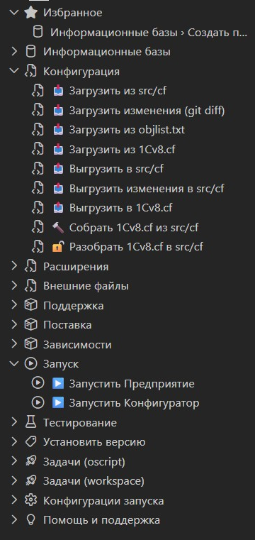

# Инструменты 1С

Основное дерево команд в activity bar — **Инструменты 1С**. Появляется после открытия проекта 1С (каталог с `packagedef`).

## Разделы дерева

- **Информационные базы** — создание, обновление, загрузка/выгрузка DT, инициализация данных.
- **Конфигурация** — загрузка и выгрузка `src/cf`, работа с `1Cv8.cf`, инкрементальная загрузка/выгрузка, сборка и разбор.
- **Расширения** — загрузка и выгрузка `src/cfe`, работа с `*.cfe`, сборка и разбор.
- **Внешние файлы** — сборка и разбор `epf`/`erf`, очистка кэша.
- **Поддержка** и **Поставка** — команды поддержки конфигурации и подготовки файлов поставки.
- **Зависимости** — инициализация `packagedef`, структуры проекта, Git, OneScript, OPM и зависимостей.
- **Запуск**, **Тестирование**, **Установить версию**, **Конфигурации запуска**, **Навыки для AI**, **Помощь и поддержка**.

Команды выполняются через [vanessa-runner](https://github.com/vanessa-opensource/vanessa-runner) в терминале VS Code — вывод всегда виден.

## Избранное и палитра

- Часто используемые команды добавьте в избранное: **1C: Дерево: Настроить избранное** — раздел «Избранное» появится вверху дерева.
- Все команды доступны из палитры (`Ctrl+Shift+P` → введите «1C»).

## Настройки

- `1c-platform-tools.paths.*` — пути к исходникам (`src/cf`, `src/cfe`, `src/epf`, `src/erf`) и результатам сборки.
- `1c-platform-tools.vrunner.*` — путь и параметры vanessa-runner; по умолчанию используется `oscript_modules/bin/vrunner.bat` проекта, если он есть.
- `1c-platform-tools.useIbcmd` — выполнять команды через `ibcmd` без GUI (нужен компонент сервера 1С).
- Выполнение в Docker — [docker.md](docker.md).
