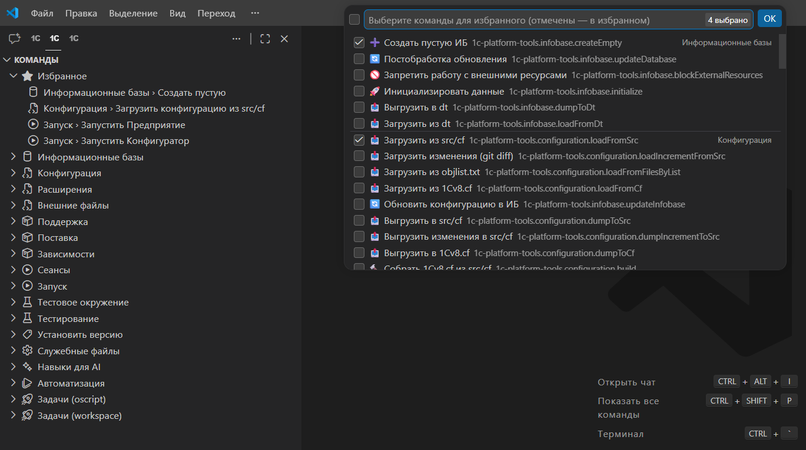

# Инструменты 1С

Основное дерево команд в activity bar — **Инструменты 1С**. Появляется после открытия проекта 1С (каталог с `packagedef`).



<!-- дерево команд: начало (собирается gen-commands-tree.mjs) -->

```text
ИНСТРУМЕНТЫ 1С
├─ Информационные базы
│  ├─ ➕ Создать пустую ИБ
│  ├─ 🔄 Постобработка обновления
│  ├─ 🚫 Запретить работу с внешними ресурсами
│  ├─ 🚀 Инициализировать данные
│  ├─ 📤 Выгрузить в dt
│  └─ 📥 Загрузить из dt
├─ Конфигурация
│  ├─ 📥 Загрузить из src/cf
│  ├─ 📥 Загрузить изменения (git diff)
│  ├─ 📥 Загрузить из objlist.txt
│  ├─ 📥 Загрузить из 1Cv8.cf
│  ├─ 🔄 Обновить конфигурацию в ИБ
│  ├─ 📤 Выгрузить в src/cf
│  ├─ 📤 Выгрузить изменения в src/cf
│  ├─ 📤 Выгрузить в 1Cv8.cf
│  ├─ 🔨 Собрать 1Cv8.cf из src/cf
│  └─ 🔓 Разобрать 1Cv8.cf в src/cf
├─ Расширения
│  ├─ 📥 Загрузить из src/cfe
│  ├─ 📥 Загрузить из objlist.txt
│  ├─ 📥 Загрузить из *.cfe
│  ├─ 🔄 Обновить расширения в ИБ
│  ├─ 📤 Выгрузить в src/cfe
│  ├─ 📤 Выгрузить в *.cfe
│  ├─ 🔨 Собрать *.cfe из src/cfe
│  └─ 🔓 Разобрать *.cfe в src/cfe
├─ Внешние файлы
│  ├─ 🔨 Собрать внешнюю обработку
│  ├─ 🔨 Собрать внешний отчет
│  ├─ 🔨 Собрать unit тесты
│  ├─ 🔓 Разобрать внешнюю обработку
│  ├─ 🔓 Разобрать внешний отчет
│  ├─ 🔓 Разобрать unit тесты
│  └─ 🗑️ Удалить кэш
├─ Поддержка
│  ├─ 📤 Выгрузить в 1Cv8dist.cf
│  ├─ 📥 Загрузить из cf/cfu
│  └─ 🗑️ Удалить
├─ Поставка
│  ├─ 📄 Создать файл описания шаблона поставки
│  ├─ 📦 Создать файлы поставки и обновления (cf/cfu)
│  ├─ 📦 Создать комплект
│  └─ 📄 Создать файл списка шаблонов
├─ Зависимости
│  ├─ 📝 Инициализировать проект
│  ├─ 📁 Инициализировать структуру проекта
│  ├─ 🔧 Настроить Git
│  ├─ 📦 Установить OneScript
│  ├─ 📦 Установить пакетный менеджер
│  ├─ 📦 Установить зависимости
│  └─ 🗑️ Удалить зависимости
├─ Сеансы
│  ├─ 🔒 Запретить начало сеансов
│  ├─ 🔓 Разрешить начало сеансов
│  ├─ 🔒 Запретить регламентные задания
│  ├─ 🔓 Разрешить регламентные задания
│  ├─ ⛔ Завершить сеансы
│  ├─ 📋 Показать сеансы
│  └─ 🔍 Проверить отсутствие сеансов
├─ Запуск
│  ├─ ▶️ Запустить Предприятие
│  └─ ▶️ Запустить Конфигуратор
├─ Тестирование
│  ├─ 🧪 XUnit тесты
│  ├─ 🧪 Синтаксический контроль
│  ├─ 🧪 Vanessa тесты
│  ├─ 🧪 YAxUnit тесты
│  └─ 📊 Allure отчет
├─ Установить версию
│  ├─ 🏷️ Конфигурации
│  └─ 🏷️ Расширения
├─ Служебные файлы
│  ├─ Создать служебные файлы
│  ├─ Базовый набор
│  ├─ .gitignore
│  ├─ .gitattributes
│  └─ env.json
├─ Навыки для AI
│  ├─ 🔌 Настроить MCP для Cursor
│  ├─ 🤖 Добавить навыки расширения (команды и MCP)
│  └─ 📐 Добавить навыки разработки 1С (cc-1c-skills)
└─ Помощь и поддержка
   ├─ С чего начать?
   ├─ Сообщить о проблемах
   ├─ Написать отзыв
   └─ Стать спонсором
```

<!-- дерево команд: конец -->

## Разделы дерева

- **Информационные базы** — создание, обновление, загрузка/выгрузка DT, инициализация данных.
- **Конфигурация** — загрузка и выгрузка `src/cf`, работа с `1Cv8.cf`, инкрементальная загрузка/выгрузка, сборка и разбор.
- **Расширения** — загрузка и выгрузка `src/cfe`, работа с `*.cfe`, сборка и разбор.
- **Внешние файлы** — сборка и разбор `epf`/`erf`, очистка кэша.
- **Поддержка** и **Поставка** — команды поддержки конфигурации и подготовки файлов поставки.
- **Зависимости** — инициализация `packagedef`, структуры проекта, Git, OneScript, OPM и зависимостей.
- **Служебные файлы** — создание `.gitignore`, `.gitattributes`, основного [профиля запуска](launch-profiles.md) и файлов `tools/*` ([service-files.md](service-files.md)).
- **Сеансы** — запрет и разрешение начала сеансов, завершение сеансов, проверка их отсутствия, запрет и разрешение регламентных заданий (см. [Сеансы информационной базы](#сеансы-информационной-базы)).
- **Автоматизация** — пайплайны и хуки команд, см. [Автоматизация](automation.md).
- **Запуск**, **Тестирование**, **Установить версию**, **Конфигурации запуска**, **Навыки для AI**, **Помощь и поддержка**.

Панель состоит из двух плашек: **Команды** (дерево команд) и **Помощь и поддержка** (ссылки на документацию и поддержку).

Активный [профиль запуска](launch-profiles.md) выбирается в статусной строке (слева) и подставляется во все команды vrunner.

## Сеансы информационной базы

Группа **Сеансы** готовит базу к обновлению: закрывает вход, завершает оставшиеся сеансы и проверяет, что база свободна. Команды работают через утилиты кластера `rac` и `ras`.

| Команда | Что делает |
|---|---|
| Запретить начало сеансов | Новые сеансы не начинаются; задаются сообщение пользователю и код допуска |
| Разрешить начало сеансов | Снимает запрет |
| Запретить регламентные задания | Останавливает выполнение заданий: запрет входа сам по себе их не гасит |
| Разрешить регламентные задания | Возвращает выполнение заданий |
| Завершить сеансы | Завершает активные сеансы; по умолчанию заодно запрещает начало новых |
| Проверить отсутствие сеансов | Завершается ошибкой, если сеансы найдены |
| Показать сеансы | Список сеансов с приложением, пользователем, компьютером и временем; только 3.x |

**Параметры подключения задаются в профиле запуска, а не в настройках расширения.** vanessa-runner читает файл настроек сам, и аргументы командной строки его перекрывают, поэтому расширение ничего не подставляет. Внутри файла блок команды приоритетнее блока `default`, а сама утилита `rac` находится по версии платформы автоматически.

Для vanessa-runner 2.x в `env.json` (или `env.<профиль>.json`):

```json
"session": {
    "--ras": "srv:1545",
    "--db": "erp",
    "--cluster-admin": "ClusterAdmin",
    "--cluster-pwd": "пароль",
    "--uccode": "код-допуска"
},
"scheduledjobs": {
    "--ras": "srv:1545",
    "--db": "erp"
}
```

Для 3.x в `autumn-properties.json` те же параметры лежат в общей секции кластера:

```json
{
  "vrunner": {
    "cluster": {
      "ras": "srv:1545",
      "db-name": "erp",
      "cluster-admin": "ClusterAdmin",
      "cluster-pwd": "пароль"
    }
  }
}
```

Пароль администратора кластера и код допуска можно не хранить в файле: vanessa-runner читает их из переменных окружения `RUNNER_CLUSTERADMIN_USER` и `RUNNER_CLUSTERADMIN_PWD` (в 3.x - `VRUNNER_CLUSTERADMIN_*`).

Команды работают с серверной базой: у файловой кластера нет, о неприменимости сообщит сам vanessa-runner.

Версии vanessa-runner различаются, команда строится под установленную. В 2.x нет списка сеансов, в 3.x нет времени начала и окончания блокировки: она применяется сразу. О недоступном действии команда сообщает до запуска. Регламентные задания есть в обеих версиях: `scheduledjobs` в 2.x и `cluster jobs` в 3.x.

Отбор сеансов задаётся одинаково для обеих версий, записью 2.x: `appid=Designer;1CV8|name=рег1;рег2`. Значения внутри условия перечисляются через точку с запятой, условия объединяются по ИЛИ. Для 3.x расширение раскладывает эту запись на опции `--filter-app` и `--filter-name`, а режим `EXCEPT` превращает во флаг инверсии. Режимы `DEFAULT` и `ALL` есть только в 2.x: в 3.x аналога нет, и команда об этом скажет, а не отбросит отбор молча.

Завершение сеансов в 3.x проверяет результат: `rac` завершает сеансы асинхронно, поэтому vanessa-runner перечитывает список и добивает зависшие. Число попыток задаётся параметром `sessionRetry` (по умолчанию три), а `sessionTimeout` заставляет повторять до успеха или до истечения времени. Проверка отсутствия сеансов с `sessionTimeout` ждёт, пока фоновые задания сами доработают.

Список сеансов и ожидание появились в vanessa-runner 3.0.0-rc14. На более ранних сборках 3.x команды дойдут до vanessa-runner и он сообщит, что действия не знает.

Одно ограничение 3.x пока остаётся: значения с пробелами не проходят разбор параметров, поэтому сообщение блокировки вида «Идёт обновление» на 3.x не дойдёт. Сообщение без пробелов проходит, в 2.x ограничения нет.

При вызове агентом можно задать параметры разового запуска, не трогая профиль: `lockMessage`, `accessCode`, `lockStart`, `lockEnd`, `sessionFilter`, `sessionFilterMode`, `keepSessionsUnlocked`, `sessionRetry`, `sessionTimeout` и `sessionConnections`.

## Выбор расширений для команд

Команды группы **Расширения** (загрузка и выгрузка `src/cfe` и `*.cfe`, загрузка из `objlist.txt`, обновление в ИБ, сборка, разбор), а также **Установить версию → Расширения** работают не со всеми каталогами `src/cfe`, а с выбранным подмножеством. Это удобно, когда в проекте много расширений, а разработка идёт по нескольким: не нужно ждать, пока отработают все.

Источник выбора определяется так:

1. **Настройка `1c-platform-tools.extensions.selected`.** Если в `settings.json` задан список имён каталогов расширений — команды используют его **без окна выбора**. Имена сравниваются без учёта регистра; отсутствующие в `src/cfe` — пропускаются.
2. **Интерактивный выбор.** Если настройка пуста, при запуске команды показывается выпадающий список с чекбоксами по каталогам `src/cfe`:
   - изначально отмечены все;
   - снятый выбор запоминается для проекта (локально, не коммитится) и подставляется при следующем запуске любой команды расширений;
   - если оставить отмеченными все — выбор сбрасывается, и новые расширения подхватываются автоматически.

Пример `.vscode/settings.json` — команды будут работать только с этими двумя расширениями, без окна выбора:

```jsonc
{
  "1c-platform-tools.extensions.selected": [
    "РасширениеПоЗарплате",
    "РасширениеПоБюджетированию"
  ]
}
```

Пустой список (`[]`) или отсутствие настройки возвращает интерактивный выбор.

## Запуск команд: задачи VS Code

По умолчанию команды [vanessa-runner](https://github.com/vanessa-opensource/vanessa-runner) и `opm` (установка зависимостей, запуск oscript-задач) выполняются как **задачи VS Code** (Tasks). Это даёт:

- **«Rerun Last Task».** Последний запуск повторяется командой палитры **Tasks: Rerun Last Task** (по умолчанию без хоткея, можно назначить свой).
- **Запуск из списка задач и `tasks.json`.** Команды видны в **Tasks: Run Task**, их можно вынести в `tasks.json`, навесить хоткей или включить в составную задачу.
- **Единый статус и вывод.** Прогон идёт в панели задачи; вывод виден полностью, задачу можно остановить (она завершает всё дерево процессов `cmd → oscript → 1cv8`).

Отключить и вернуться к обычному интерактивному терминалу можно настройкой `1c-platform-tools.execution.useTasks: false`.

### Свои задачи в `tasks.json`

Команды vrunner можно описывать вручную в `.vscode/tasks.json` (тип `1c-vrunner`):

```jsonc
{
  "version": "2.0.0",
  "tasks": [
    {
      "type": "1c-vrunner",
      "command": "vanessa",
      "args": ["--settings", "env.json"],
      "label": "1C: Прогнать Vanessa",
      "group": "test"
    },
    {
      "type": "1c-vrunner",
      "command": "compile",
      "args": ["--src", "src/cf"],
      "label": "1C: Собрать конфигурацию"
    }
  ]
}
```

Запуск — **Tasks: Run Task** → выбрать задачу. Поле `command` — это команда vrunner (`vanessa`, `compile`, `syntax-check`, `init-dev` и т.д.), `args` — её аргументы.

## Установка OneScript

Команда **Установить OneScript** в разделе **Зависимости** ставит выбранную версию через [OVM](https://github.com/oscript-library/ovm). Сам `ovm.exe` расширение загружает из релизов GitHub и держит в своём кэше рядом с остальными внешними компонентами: он обновляется при выходе новой версии и переустанавливается командой **1C: Внешние компоненты: Обновить внешние компоненты**.

Переопределить загрузку можно в разделе настроек **Внешние компоненты**:

| Настройка               | Назначение                                            |
|-------------------------|-------------------------------------------------------|
| `components.ovmFile`    | путь к своему `ovm.exe` вместо загрузки с GitHub      |
| `components.ovmAutoload`| выключает загрузку, если путь выше не задан           |

## Избранное и палитра

- Часто используемые команды добавьте в избранное: **1C: Дерево: Настроить избранное** — раздел «Избранное» появится вверху дерева.
- Все команды доступны из палитры (`Ctrl+Shift+P` → введите «1C»).

## Скрытие групп

Ненужные группы дерева **Команды** можно скрыть: кнопка-глаз в шапке плашки (справа от «Избранного») открывает список групп с чекбоксами — снимите отметку, чтобы скрыть. Когда что-то скрыто, значок меняется на перечёркнутый глаз.

Выбор хранится на пользователя (не в `settings.json` проекта). «Избранное» не затрагивается: закреплённые команды остаются видны независимо от скрытых групп.

## Уведомления

Рутинные подтверждения (дерево обновлено, файл создан, свойства сохранены) показываются в строке состояния и исчезают сами; полный след остаётся в журнале расширения (**Выходные данные** → «1C: Platform Tools»). Всплывающие окна оставлены для ошибок, предупреждений и сообщений с кнопками.

## Настройки

- `1c-platform-tools.paths.*` — пути к исходникам (`src/cf`, `src/cfe`, `src/epf`, `src/erf`) и результатам сборки.
- `1c-platform-tools.extensions.selected` — список расширений (имена каталогов в `src/cfe`), с которыми работают команды группы «Расширения» и установка версии расширений. Пусто — интерактивный выбор с запоминанием, см. [Выбор расширений для команд](#выбор-расширений-для-команд).
- `1c-platform-tools.vrunner.*` — путь и параметры vanessa-runner; по умолчанию используется `oscript_modules/bin/vrunner.bat` проекта, если он есть.
- `1c-platform-tools.execution.useTasks` — запускать команды как задачи VS Code (Rerun Last Task, запуск из списка задач); по умолчанию `true`. `false` — обычный интерактивный терминал.
- `1c-platform-tools.useIbcmd` — выполнять команды через `ibcmd` без GUI (нужен компонент сервера 1С).
- Выполнение в Docker — [docker.md](docker.md).
