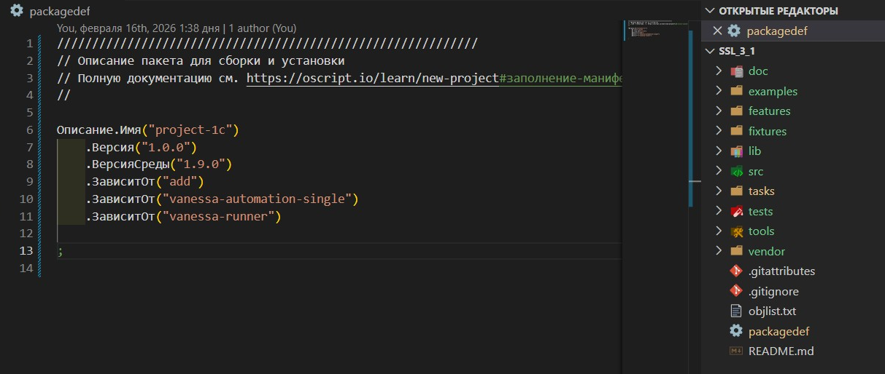

# Шаг 1 — Проект

Проект 1С — это папка с файлом `packagedef` в корне. Расширение активируется только когда видит этот файл.

**Что выбрать?**

* Если у вас уже есть проект — **«Откройте папку»**.
* Если начинаете с нуля — нажмите **«Создать проект»**: появится `packagedef` и базовая структура.
* Если папка с кодом есть, но `packagedef` нет — **«Инициализировать текущий»** добавит только `packagedef`.
* Нужны каталоги `docs, src/cf, features, tests`? **«Инициализировать структуру»** создаст их по шаблону `vanessa-bootstrap`, не трогая существующие файлы.
