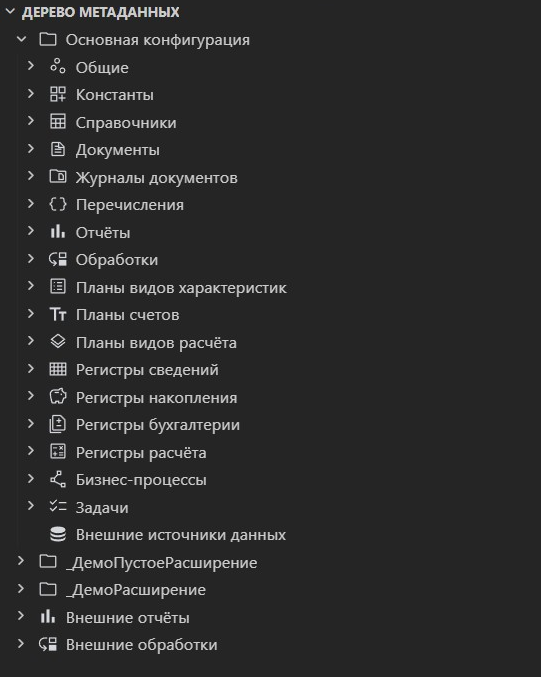

# Шаг 10 — Дерево метаданных

Панель **«Метаданные 1С»** показывает структуру конфигурации и расширений: объекты сгруппированы по разделам, а нужный элемент можно быстро открыть прямо из дерева.

Для объектов доступны основные действия из контекстного меню: открыть свойства, добавить, переименовать, дублировать, удалить, скопировать имя или путь. Если вы работаете по подсистемам, используйте фильтр — так проще сосредоточиться на нужной части конфигурации.

Если дерево отображается неактуально после изменений в исходниках, нажмите **«Обновить»**. Дополнительные параметры автозагрузки Java/JAR и пути к инструментам находятся в **настройках метаданных**.
