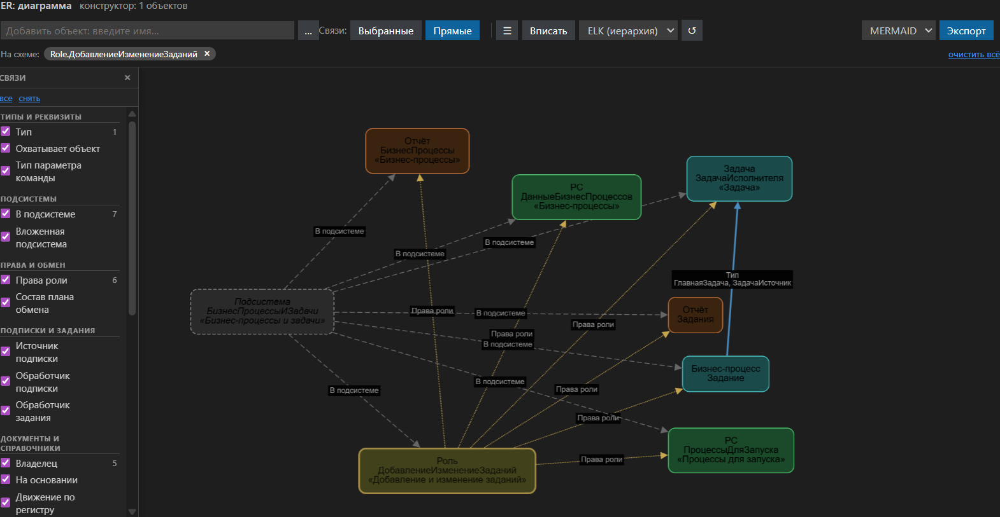

# Шаг 11 — ER-диаграммы метаданных

**ER-диаграмма** — интерактивная схема связей объектов конфигурации прямо в IDE. Выберите объекты, которые вас интересуют, и сразу увидите, как они связаны между собой через реквизиты, табличные части, движения и другие зависимости.

Откройте диаграмму через кнопку на панели **«Метаданные 1С»** (значок ER) или через контекстное меню любого объекта метаданных — откроется конструктор с выбранным объектом и его прямыми связями.

В конструкторе вы можете добавлять объекты через строку поиска, переключаться между режимами глубины («Выбранные» — только выбранные объекты, «Прямые» — с их прямыми связями), а также фильтровать виды связей по типам.

Диаграмму можно экспортировать в Mermaid, SVG, PNG или DrawIO — результат сохраняется в папку `docs/schemas` (или в указанный вами каталог в настройках).
