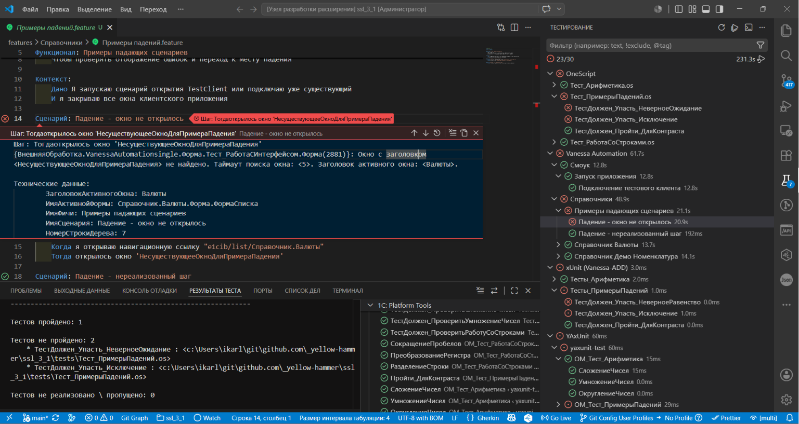

# Шаг 12 — Панель тестирования

<!-- TODO: заменить заглушку на скриншот панели тестирования (images/step12.png) -->

Тесты проекта отображаются в нативной панели **Тестирование** VS Code (иконка колбы в Activity Bar) — с деревом по каталогам, кнопками запуска в редакторе и статусами по каждому тесту.

**Поддерживаются фреймворки:** Vanessa Automation (`.feature`), xUnit/Vanessa-ADD (тестовые обработки), YAxUnit, OneScript (1testrunner/OneUnit, `.os`), 1bdd.

**Запуск** — файл, каталог или весь набор; для YAxUnit, OneScript и 1bdd доступен запуск отдельного теста. При падении — сообщение об ошибке и переход к строке теста.

**Unit тесты 1С (тестовые обработки)**: исходники храните в `src/tests`, собранные `.epf` — в `build/out/tests` (вне git). Команды «Собрать/Разобрать unit тесты» — в группе «Внешние файлы» дерева команд, а панель тестирования собирает обработку автоматически перед прогоном. Скриптовые тесты OneScript (`.os`) лежат в `tests`.

Результаты читаются из настроек проекта (`env.json`, `tools/VAParams.json`, `tools/yaxunit.json`) — отдельная настройка не требуется.

Подробнее — в [руководстве по тестированию](https://github.com/yellow-hammer/vscode-1c-platform-tools/blob/main/docs/testing.md).
