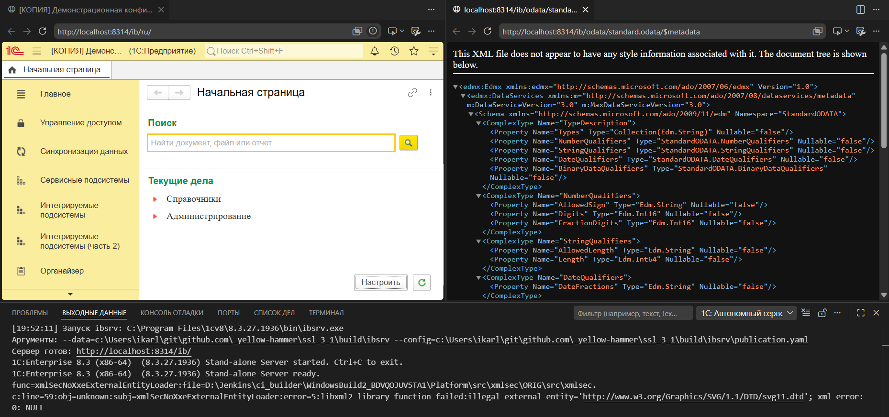

# Шаг 13 — Автономный сервер

Расширение поднимает **автономный сервер 1С** (`ibsrv`) для файловой ИБ проекта — локальная разработка и отладка REST (HTTP-сервисы), SOAP (Web-сервисы) и OData без отдельной серверной установки.

**Запуск.** Команда **1C: Автономный сервер: Запустить** или клик по индикатору в статус-баре (запущенный сервер выделяется янтарным фоном). Путь к ИБ берётся из `--ibconnection` активного [профиля запуска](command:1c-platform-tools.env.selectProfile) (только файловая ИБ `/F`), параметры сервера — из настроек `1c-platform-tools.server.*`.

**Что публиковать.** **Выбрать публикуемые сервисы** — отметьте OData и конкретные HTTP/Web-сервисы по дереву метаданных. «Все …» и отдельные сервисы взаимоисключают друг друга.

**Открыть в браузере.** Корень публикации и OData `$metadata`. HTTP-сервисы доступны по `…/hs/<root>`.

**Отладка через сервер.** Поднимает сервер с портом отладки и цепляет отладчик расширения — серверный код сервисов отлаживается без отдельной лицензии.

**Конфиг публикации.** Лежит в `build/ibsrv/publication.yaml`: можно остановить сервер, поправить параметры (например порт) прямо в файле и запустить заново.

Подробнее — в [руководстве по автономному серверу](https://github.com/yellow-hammer/vscode-1c-platform-tools/blob/main/docs/autonomous-server.md).
