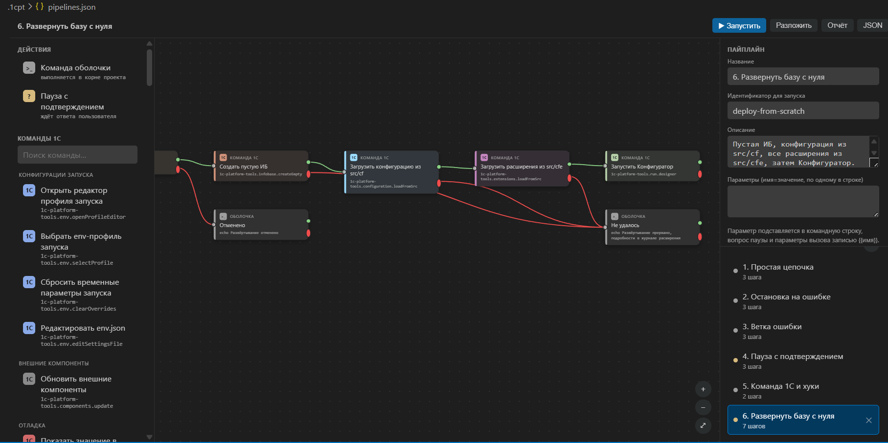

# Шаг 14 — Автоматизация: пайплайны и хуки

Повторяющиеся действия описываются один раз и дальше выполняются целиком.

**Пайплайн** — цепочка шагов, которую запускают явно: запретить сеансы, завершить оставшиеся, загрузить конфигурацию, прогнать тесты. Шаги связаны в граф, у каждого есть ветка на успех и на ошибку, поэтому «если тесты упали, собрать отчёт и остановиться» описывается связями, а не условиями в скриптах. Шагом может быть команда расширения, командная строка или пауза с подтверждением. Цепочка собирается на полотне: блоки из палитры слева, связи мышью, свойства и список цепочек справа.

**Хук** — шаги, которые срабатывают сами вокруг любой команды расширения: до неё, после неё или при ошибке. Типовое применение: подготовить исходники перед загрузкой в ИБ и вернуть их как было после.

Группа **Автоматизация** в дереве «1С: Инструменты» содержит редактор пайплайнов, сохранённые цепочки, редактор хуков и команды с заданными хуками. Хранится всё в служебных файлах проекта `.1cpt/pipelines.json` и `.1cpt/hooks.json` — их можно править и формой, и руками.

Подробнее — [Автоматизация](../docs/automation.md).
