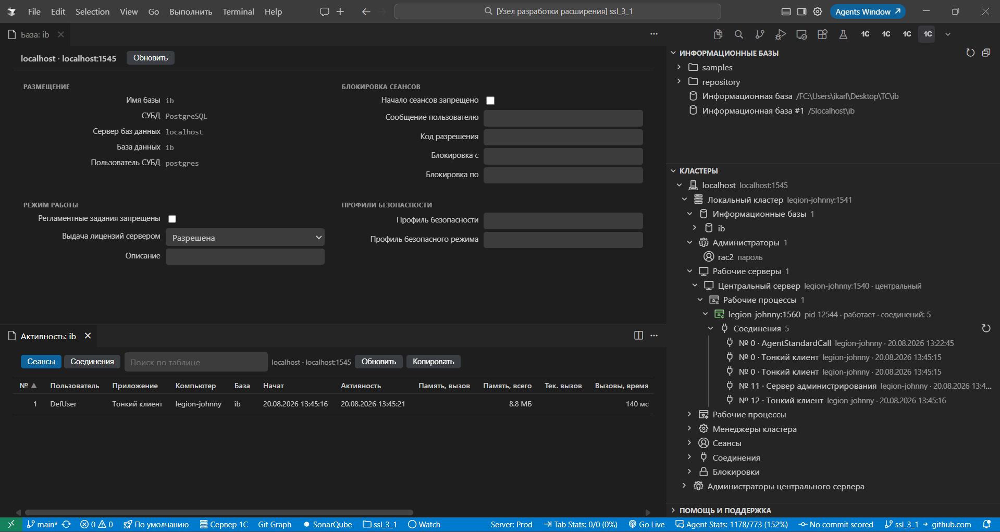

# Шаг 15 — Администрирование 1С

Панель **«Администрирование 1С»** доступна всегда: проект 1С для неё не нужен. Сверху — **информационные базы** платформы, ниже — **кластеры**.

Список баз тот же, что у 1С при запуске. Клик по имени ничего не открывает: в конце строки **Предприятие** и **Конфигуратор**. Запускает `1cestart` по записи списка, поэтому версия клиента и окно входа такие же, как у платформы.

Кластер подключается к `ras` (порт 1545). В дереве — базы, серверы, процессы и сеансы. Из узла открываются свойства и таблица активности; необратимое подтверждается.

Не найден `1cestart` или `rac` — укажите каталог платформы в настройках кластеров.
