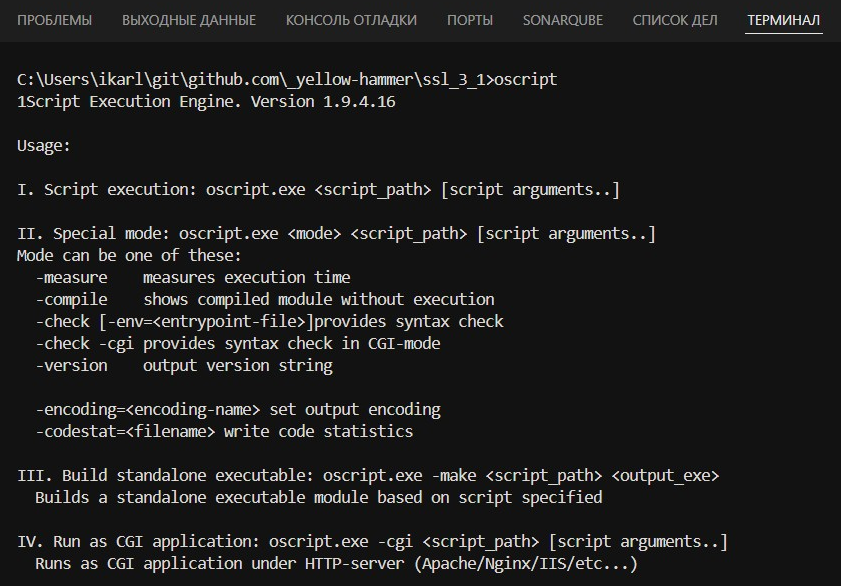

# Шаг 2 — Зависимости

Для работы скриптов, vrunner и тестов нужны Git, OneScript и менеджер пакетов OPM.

* **Начните с Git** — укажите имя и e-mail в репозитории, чтобы коммиты были подписаны.
* Затем установите **OneScript** (интерпретатор) и **Пакетный менеджер OneScript** (opm) — они позволят устанавливать пакеты из `packagedef`.
* Последний шаг — **«Установить зависимости»**: все пакеты, включая `vanessa-runner`, появятся в `oscript_modules`. Без этого команды расширения (сборка, тесты, выгрузка) работать не будут.

Без доступа к интернету команды установки не помогут: скачайте OneScript и компоненты на машине с сетью, распакуйте в любой каталог и укажите пути настройками `1c-platform-tools.components.path.*`. Права администратора не нужны, порядок описан в руководстве [Внешние компоненты](https://yellow-hammer.github.io/vscode-1c-platform-tools/components.html#машина-без-доступа-к-github).
