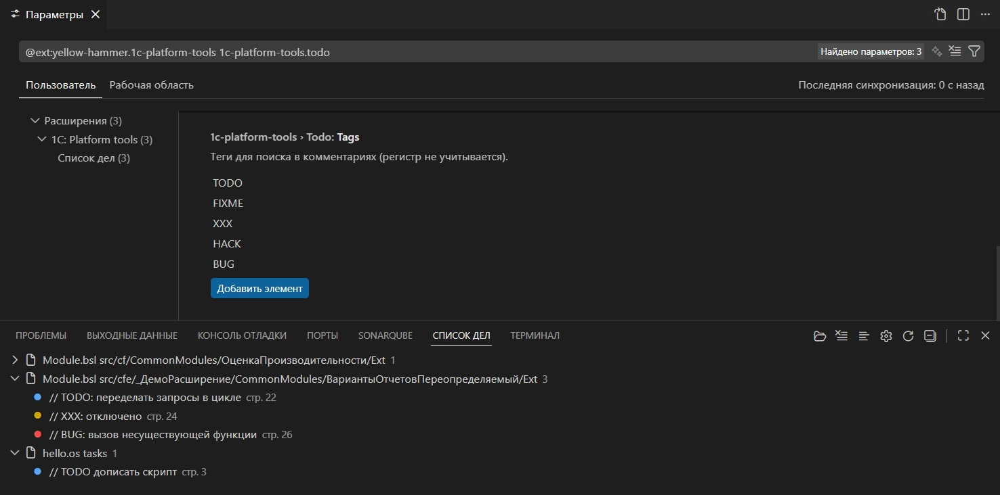

# Шаг 6 — Панель проектов

Если вы работаете с несколькими проектами 1С, панель **«1С: Проекты»** на боковой панели поможет быстро переключаться между ними.

Укажите в настройках **baseFolders** — папки, где расширение будет искать проекты (каталоги с `packagedef`). **ignorePatterns** исключит ненужные подпапки (например `.git`, `out`). Найденные проекты появятся в разделе «Все проекты». Добавьте нужные в **избранное** и организуйте их тегами (Личное, Работа). Быстрый выбор — команда «1С: Проекты → Открыть список» или `Ctrl+Alt+P`.
