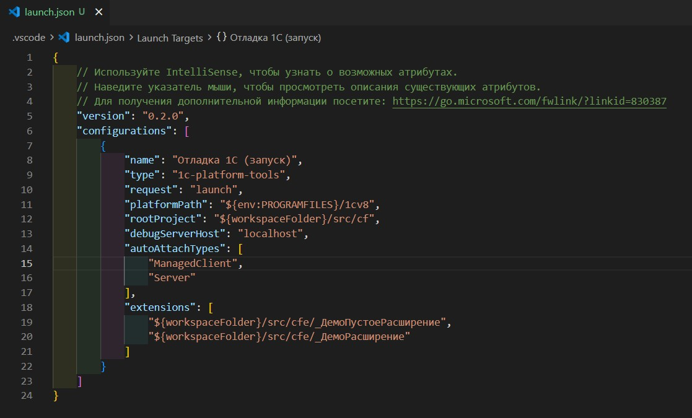

# Шаг 8 — Отладка 1С

Расширение поддерживает отладку 1С:Предприятие через [onec-debug-adapter](https://github.com/yellow-hammer/onec-debug-adapter) (DAP для HTTP-сервера отладки 1С).

**Требования.** Установленный [.NET 8](https://dotnet.microsoft.com/download/dotnet/8.0).

**Подключение к ИБ.** Адрес информационной базы берётся из **env.json** в корне проекта. В `default["--ibconnection"]` укажите строку в формате **/F** (файловая ИБ) или **/S** (серверная ИБ), например `/F./build/ib` или `/Sсервер\база`.

**Запуск отладки.** В панели **Run and Debug** выберите конфигурацию типа **1Cpt:Enterprise** (launch). При создании конфигурации поля `rootProject` и `extensions` заполняются по настройкам `1c-platform-tools.paths.cf` и `1c-platform-tools.paths.cfe`; при необходимости отредактируйте `platformPath`, `autoAttachTypes` и другие параметры в **launch.json**.

**Debug targets.** В панели отладки доступен список целей с возможностью ручного подключения (Connect).

Конфигурации отладки можно редактировать в **launch.json** — откройте его через дерево (Конфигурации запуска) или команду [Открыть launch.json](command:1c-platform-tools.launch.editConfigurations).
