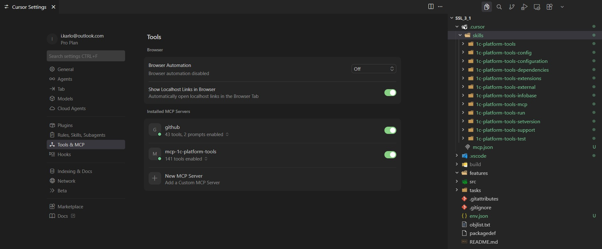

# Шаг 9 — Интеграция с AI и MCP

Расширение помогает AI-агентам (Cursor, Claude, Copilot) работать с проектом 1С: агент узнаёт, какие команды вызывать, и может выполнять их через навык или MCP.

**Навыки для агента.** В группе «Навыки для AI» доступны две команды: **«Добавить навыки разработки 1С (cc-1c-skills)»** (XML, формы, роли, СКД, метаданные — скачиваются с GitHub при каждом вызове) и **«Добавить навыки расширения (команды и MCP)»** (инструкции по командам расширения и MCP по доменам). Выберите команду и папку назначения (для Cursor — «Для Cursor»). Агент будет предлагать выполнять команды расширения и использовать MCP вместо ручного запуска скриптов.

**Запуск по файлу.** Если агент умеет создавать файлы, он может записать в `.cursor/1c-platform-tools-run-command` одну строку — идентификатор команды (например `1c-platform-tools.run.designer`). Расширение выполнит команду и удалит файл.

**MCP.** Для вызова команд через Model Context Protocol установите и настройте [mcp-1c-platform-tools](https://github.com/yellow-hammer/mcp-1c-platform-tools). Включите в настройках расширения опцию `1c-platform-tools.ipc.enabled`. Подробности — в основном README расширения, раздел «Интеграция с AI и MCP».
